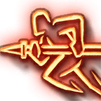

**Fury** is a modded Subclass of [Barbarian](https://bg3.wiki/wiki/Barbarian) that foregoes the defensive bonuses of [Rage](https://bg3.wiki/wiki/Rage) to instead gain more Rage Charges and new attacks to spend them on. Synergizes heavily with dual wielding.

> {{ get .loca "hf66e9153gca0eg4a51gba5bg7bc315652d59" | quote }}

</h3>

# Subclass Features

## Level 3

## Fury Attacks: 2 Known
- Choose 2 [Fury Attacks](#fury-attacks) to know

### Rampage (Replaces Rage)

{{ getf .loca "haa4d01a9g591fg4694gb818g1ee27b2538cd" | include "wikify" }}

### Single-Minded Fury

When you make an offhand attack while Raging, you can add your Ability Score Modifier to the damage of the attack.

*Does not stack with Two Weapon Fighting if obtained from another source*

## Level 6

## Fury Attacks: 3 Known
- Choose 2 additional [Fury Attacks](#fury-attacks) to know

### Anger Management

{{ getf .loca "h87e29030gc8ebg44ceg86ceg2e9468fff092" | include "wikify" }}

### Titan's Grip

You can use Two-Weapon Fighting even if your weapons aren't [Light](https://bg3.wiki/wiki/Light_(Weapon_Property)).

*Currently making the call not to implement a real 2-handed version of Titan's Grip. I've seen the way it's been done before and it's too janky for my taste, and I don't see a path to making it less janky at the moment.*

## Level 10

## Fury Attacks: 4 Known
- Choose 2 additional [Fury Attacks](#fury-attacks) to know

### Recklessness

- Once per [Long Rest](https://bg3.wiki/wiki/Long_Rest)
- {{ getf .loca "hb02d2a55gb259g4629ga232ga4e0fd8b8751" | replace "Reckless Attack" "[Reckless Attack](https://bg3.wiki/wiki/Reckless_Attack)" | include "wikify" }}

## Fury Attacks

You pick new Fury attacks to know at Levels 3, 6 and 10.

### Bloodthirst
- Costs 1 Action, 1 Rage charge on hit
- Weapon Attack
- {{ getf .loca "h7cfa12d9ga912g4421ga9b8g4b18f0c93fcb" "1d6 + Barbarian Level **hit points**" | include "wikify" }}

### Raging Blow
- Costs 1 Action, 1 Rage charge on hit
- Weapon Attack (+ Off-hand damage on hit)
- {{ getf .loca "hcdffe4f3gd2ffg4fecg80c0g0ef6e608c252" | include "wikify" }}

### Wild Strike
- Costs 1 Bonus Action, 1 Rage charge on hit
- Weapon Attack (Off-hand)
- {{ getf .loca "h769dce28g69f7g46f1g9cafg69714b51c3d1" | include "wikify" }}

### Execute
- Costs 1 Action, 1 Rage charge on hit
- Weapon Attack
- {{ getf .loca "h9baff8c6gb3d0g4292gb126gf254ec89fb28" "50%" "[2](## 'Proficiency Bonus')d6 damage" | include "wikify" }}

### Whirlwind
- Costs 1 Action, 1 Rage charge
- 2m AOE Weapon Attack
- {{ getf .loca "ha331a835gf3c8g4043gaa9ag68646d8ff4ac" "1" | include "wikify" }}

### Charge
- Costs 1 Bonus Action, 1 Rage Charge
- Weapon Attack, 9m range, Strength [Saving Throw](https://bg3.wiki/wiki/Saving_Throw) ([Weapon Action DC](https://bg3.wiki/wiki/Dice_rolls#Save_DCs))
- {{ getf .loca "hf0da666cg2c85g4ec5g8e19g809ec529afbf" "1" | include "wikify" }}