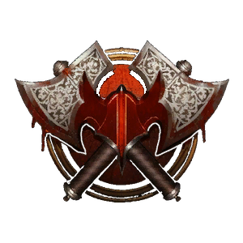

# Fury Barbarian

**Fury** is a modded Subclass of [[Barbarian]] that foregoes the defensive bonuses of [[Rage]] to instead gain more [[Rage Charges]] and new attacks to spend them on. Synergizes heavily with dual wielding.

> {{ get .loca "hf66e9153gca0eg4a51gba5bg7bc315652d59" | quote }}

## Subclass Features

### Level 3

#### Fury Attacks: 2 Known
- Choose 2 [[Fury Attacks]] to know

#### Talent: 1 Known

Choose 1 [[#warrior-talents | Warrior Talent]] from Meat Cleaver, Double Time, Sudden Death, Fresh Meat, or Deep Wounds.

![[Game/ControllerUIIcons/skills_png/Action_Barbarian_Frenzy.png]]

#### Rampage (Replaces Rage)

{{ getf .loca "haa4d01a9g591fg4694gb818g1ee27b2538cd" | include "wikify" }}

![[Game/ControllerUIIcons/skills_png/PassiveFeature_DualWielder_PassiveBonuses.png]]

#### Single-Minded Fury

When you make an offhand attack, you can add your Ability Score Modifier to the damage of the attack.

*Does not stack with Two Weapon Fighting if obtained from another source*

### Level 6

#### Fury Attacks: 4 Known
- Choose 2 additional [[Fury Attacks]] to know

#### Talents: 2 Known

Choose 1 additional [[#warrior-talents | Warrior Talent]]. Anger Management becomes available.

![[Game/ControllerUIIcons/skills_png/PassiveFeature_MindlessRage.png]]

#### Anger Management

{{ getf .loca "h87e29030gc8ebg44ceg86ceg2e9468fff092" | include "wikify" }}

![[Game/ControllerUIIcons/skills_png/PassiveFeature_DualWielder_PassiveBonuses.png]]

#### Titan's Grip

You can use Two-Weapon Fighting even if your weapons aren't ?[[Light (Weapon Property) | Light]].

*Currently making the call not to implement a real 2-handed version of Titan's Grip. I've seen the way it's been done before and it's too janky for my taste, and I don't see a path to making it less janky at the moment.*

### Level 10

#### Fury Attacks: 6 Known
- Choose 2 additional [[Fury Attacks]] to know

#### Talents: 3 Known

Choose 1 additional [[#warrior-talents | Warrior Talent]].

![[Game/ControllerUIIcons/skills_png/Action_Mag_WrecklessWarCry.png]]

#### Recklessness

- Once per [[Long Rest]]
- {{ getf .loca "hb02d2a55gb259g4629ga232ga4e0fd8b8751" | replace "Reckless Attack" "[[Reckless Attack]]" | include "wikify" }}

## Fury Attacks

You pick new Fury attacks to know at Levels 3, 6 and 10.

![[Game/ControllerUIIcons/skills_png/Action_SacrificeToLoviatar.png]]

### Bloodthirst
- Costs 1 [[Action Point]], 1 [[Rage Charge]] on hit
- Weapon Attack
- {{ getf .loca "h7cfa12d9ga912g4421ga9b8g4b18f0c93fcb" | include "wikify" }}
- 1d6 + Barbarian Level [[Hit Points]]

![[Game/ControllerUIIcons/skills_png/Action_Barbarian_FrenziedStrike.png]]

### Raging Blow
- Costs 1 [[Action Point]], 1 [[Rage Charge]] on hit
- Weapon Attack (+ Off-hand damage on hit)
- {{ getf .loca "hcdffe4f3gd2ffg4fecg80c0g0ef6e608c252" | include "wikify" }}

![[Game/ControllerUIIcons/skills_png/Action_Slash.png]]

### Wild Strike
- Costs 1 [[Bonus Action]], 1 [[Rage Charge]] on hit
- Weapon Attack (Off-hand)
- {{ getf .loca "h769dce28g69f7g46f1g9cafg69714b51c3d1" | include "wikify" }}

![[Game/ControllerUIIcons/skills_png/Action_DivineStrike_Physical_Melee.png]]

### Execute
- Costs 1 [[Action Point]], 1 [[Rage Charge]] on hit
- Weapon Attack
- {{ getf .loca "h9baff8c6gb3d0g4292gb126gf254ec89fb28" "50%" "[2](## 'Proficiency Bonus')d6" | include "wikify" }}

![[Game/ControllerUIIcons/skills_png/Action_Multiattack_WhirlwindAttack.png]]

### Whirlwind
- Costs 1 [[Action Point]], 1 [[Rage Charge]]
- 2m-radius Weapon Attack
- {{ get .loca "ha331a835gf3c8g4043gaa9ag68646d8ff4ac" | include "wikify" }}

![[images/ControllerIcons/skills_png/Action_Rush.png]]

### Charge
- Costs 1 [[Bonus Action]], 1 [[Rage Charge]]
- Weapon Attack, 9m range, [[Strength]] [[Saving Throw]] ([[Weapon Action DC]])
- {{ getf .loca "hf0da666cg2c85g4ec5g8e19g809ec529afbf" "1" | include "wikify" }}

![[Game/ControllerUIIcons/skills_png/Action_Mag_GrandSlam.png]]

### Thunder Clap

- Costs 1 [[Action Point]] and 1 [[Rage Charge]]
- [[Constitution]] Saving Throw against your Weapon Action DC; affects nearby enemies
- {{ get .loca "h1b63a656g6499g4b52g91f6g758d6e5adbff" | include "wikify" }}

![[Game/ControllerUIIcons/skills_png/Action_AbsolutePower.png]]

### Storm Bolt

- Available at Level 6
- Costs 1 [[Action Point]] and 1 [[Rage Charge]]
- 18m range, [[Constitution]] Saving Throw against your Weapon Action DC
- {{ get .loca "ha0bbee44gedc3g403cga8dage3fb613e51c1" | include "wikify" }}

## Warrior Talents

Choose Talents at levels 3, 6, and 10. Anger Management is added to the available choices at level 6.

{{ tpl (readFile "Wiki/Snippets/Warrior-Talents.md") $ }}

![[Game/ControllerUIIcons/skills_png/Action_Multiattack_WhirlwindAttack.png]]

### Meat Cleaver

{{ getf .loca "hdf52f363g33f1g4d1cg9d3bg8e469943b7f4" "2" | include "wikify" }}

![[Game/ControllerUIIcons/skills_png/Action_SacrificeToLoviatar.png]]

### Fresh Meat

{{ get .loca "had603c37g3ae0g4bfdgb7ccg34d75f1fe706" | include "wikify" }}
