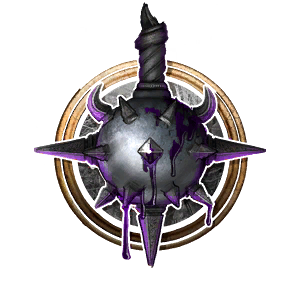

# Shadow Domain Cleric

**Shadow Domain** is a modded Subclass of [Cleric](https://bg3.wiki/wiki/Cleric) that focuses on dealing lots of Psychic damage with less of a focus on healing.

> {{ get .loca "h4efa3342g79d2g46d7g935ag073df6793b59" | quote }}

# Subclass Features

## Level 1

### Shadowform

- {{ getf .loca "h14c61a33g3215g4b41gb232ga1f172bf93de" "[1/2/3](# 'Improving at Cleric level 5 and 10')" "[1/2/3](# 'Improving at Cleric level 5 and 10')" | include "wikify" }}
- {{ getf .loca "hd52b7f22gd431g433eg9a4cg3c70da021304" | include "wikify" }}

### Shadow Word: Pain
- {{ include "wikify" "Costs 1 **Action**" }}
- Necromancy Cantrip, 18m range
- {{ getf .loca "h246efe6ag8a68g4999g87e6gde3cb1b31458" "[1d4/2d4/3d4](# 'Improving at Cleric level 5 and 10') Psychic Damage" | include "wikify" }}

### Domain Spells

You gain additional spells from your domain. They are Always Prepared. 

- [Dissonant Whispers](https://bg3.wiki/wiki/Dissonant_Whispers)
- [Tasha's Hideous Laughter](https://bg3.wiki/wiki/Tasha's_Hideous_Laughter)

## Level 2

### Lesser Mind Blast
- {{ include "wikify" "Costs 1 **Action**, 1 **Channel Divinity**" }}
- 14m Cone, {{ include "wikify" "Intelligence Saving Throw" }}
- {{ include "wikify" "2d8 + Character Level Psychic Damage" }}
- {{ getf .loca "ha794b99dg74afg42a5gbfa6gf57ed495b9b1" | include "wikify" }}

## Level 3

### Domain Spells

You gain additional spells from your domain. They are Always Prepared. 

- [Shadow Blade](https://bg3.wiki/wiki/Shadow_Blade)
- [Darkness](https://bg3.wiki/wiki/Darkness)

## Level 5

### Domain Spells

You gain additional spells from your domain. They are Always Prepared. 

- [Fear](https://bg3.wiki/wiki/Fear)
- [Hunger of Hadar](https://bg3.wiki/wiki/Hunger_of_Hadar)

## Level 6

### Shadow Word: Death
- {{ include "wikify" "Costs 1 **Action**" }}
- 18m Range, Usable Once per Long Rest
- Compel an enemy with 33 Hit Points or fewer to die instantly.

## Level 7

### Domain Spells

You gain additional spells from your domain. They are Always Prepared. 

- [Phantasmal Killer](https://bg3.wiki/wiki/Phantasmal_Killer)
- [Evard's Black Tentacles](https://bg3.wiki/wiki/Evard's_Black_Tentacles)

## Level 9

### Domain Spells

You gain additional spells from your domain. They are Always Prepared. 

- [Hold Monster](https://bg3.wiki/wiki/Hold_Monster)
- [Dominate Person](https://bg3.wiki/wiki/Dominate_Person)