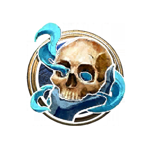
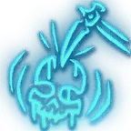
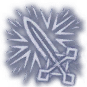

**Frost** is one of the Subclasses of <a href="Death Knight">Death Knight</a> that focuses on spending  Frost Runes to become a killing machine of  Cold damage.

<h3>

> {{ get .loca "hbd68976eg391cg46ccg8da6ga12c23823563" | quote }}

</h3>

# Subclass Features

*This subclass obtains all the features from its base class, <a href="Death Knight">Death Knight</a>, in addition to its unique features outlined below.*

## Level 3

<h3>
Runes: 
1  Blood, 
2  Frost, 
1  Unholy
</h3>

### Known Rune Spells

<ul>
  <li>
    <a href="Death Knight Spells#Howling Blast">  Howling Blast</a>
  </li>
  <li>
    <a href="Death Knight Spells#Obliterate">  Obliterate</a>
  </li>
  <li>
    <a href="Death Knight Spells#Frostscythe">  Frostscythe</a>
  </li>
</ul>

## Level 4

### Frozen Heart

{{ getf .loca "h7efee0fcg76d0g4b14gb4adg7aa0d693e7a9" "1" | include "wikify" }}

{{ get .loca "h27d45cc4g02f1g4748g9a15g70b0d1a45b84" | include "wikify" }}

## Level 5

<h3>
Runes: 
1  Blood, 
3  Frost, 
1  Unholy
</h3>

### New Rune Spells

<ul>
  <li>
    <a href="Death Knight Spells#Absolute Zero">  Absolute Zero</a>
  </li>
</ul>

## Level 6

### Rime

{{ get .loca "h9ec373dfgad97g4874gafbbg57c47213f12c" | include "wikify" }}

## Level 7

<h3>
Runes: 
2  Blood, 
4  Frost, 
2  Unholy
</h3>

### New Rune Spells

<ul>
  <li>
    <a href="Death Knight Spells#Avalanche">  Avalanche</a>
  </li>
</ul>

## Level 9

<h3>
Runes: 
2  Blood, 
5  Frost, 
2  Unholy
</h3>

### New Rune Spells

<ul>
  <li>
    <a href="Death Knight Spells#Breath of Sindragosa">  Breath of Sindragosa</a>
  </li>
</ul>

## Level 10

### Killing Machine

{{ get .loca "h98fa3d36gd69cg45abgadfdgf19bef322d3a" | include "wikify" }}

Usable Once per [Short Rest](https://bg3.wiki/wiki/Short_Rest).

## Level 11

<h3>
Runes: 
2  Blood, 
6  Frost, 
2  Unholy
</h3>

### New Rune Spells

<ul>
  <li>
    <a href="Death Knight Spells#Glacial Advance">  Glacial Advance</a>
  </li>
</ul>

### Rune Mastery

{{ get .loca "h5f27023dgdd29g4367g9e99g55c414897a3b" | include "wikify" }}

#### Empower Rune Weapon

{{ getf .loca "h03d44092g7887g43f1g8ef5g0e513acdd39e" "1d8 Cold damage" | include "wikify" }}

#### Obliteration

{{ get .loca "h80bcaa55gc41bg4be3gb9cag1e698d21412a" | include "wikify" }}