# Unholy Death Knight

**Blood** is one of the Subclasses of <a href="Death Knight">Death Knight</a> that focuses on spending  Unholy Runes to summon and empower undead minions and deal  Necrotic damage to enemies.
<h3>

> {{ get .loca "hbeb5ac97g8faeg4e7egbe96g79bb2b48cf70" | quote }}

</h3>

## Subclass Features

*This subclass obtains all the features from its base class, <a href="Death Knight">Death Knight</a>, in addition to its unique features outlined below.*

### Level 3

<h3>
Runes: 
1  Blood, 
1  Frost, 
2  Unholy
</h3>

#### Known Rune Spells

<ul>
  <li>
    <a href="Death Knight Spells#outbreak"> 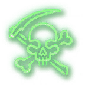 Outbreak</a>
  </li>
  <li>
    <a href="Death Knight Spells#festering-strike"> 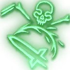 Festering Strike</a>
  </li>
  <li>
    <a href="Death Knight Spells#scourge-strike"> 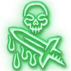 Scourge Strike</a>
  </li>
</ul>

#### New Rune Spells

<ul>
  <li>
    <a href="Death Knight Spells#raise-dead"> 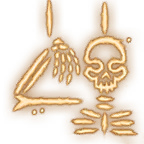 Raise Dead</a>
  </li>
</ul>

### Level 4

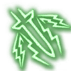

#### Dreadblade

{{ getf .loca "hf1f54bbag0888g40c0g8fbdgcb1efbe6e14b" | include "wikify" }}

### Level 5

<h3>
Runes: 
1  Blood, 
1  Frost, 
3  Unholy
</h3>

#### New Rune Spells

<ul>
  <li>
    <a href="Death Knight Spells#raise-ally"> 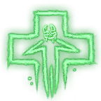 Raise Ally</a>
  </li>
  <li>
    <a href="Death Knight Spells#unholy-aura">  Unholy Aura</a>
  </li>
</ul>

### Level 6

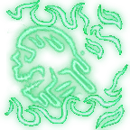

#### Sudden Doom

{{ get .loca "hbfe516fdgc602g4171g9fe5g569688d7980e" | include "wikify" }}

### Level 7

<h3>
Runes: 
2  Blood, 
2  Frost, 
4  Unholy
</h3>

#### New Rune Spells

<ul>
  <li>
    <a href="Death Knight Spells#dark-transformation">  Dark Transformation</a>
  </li>
  <li>
    <a href="Death Knight Spells#defile"> 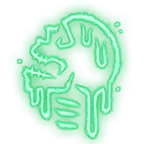 Defile</a>
  </li>
</ul>

### Level 9

<h3>
Runes: 
2  Blood, 
2  Frost, 
5  Unholy
</h3>

#### New Rune Spells

<ul>
  <li>
    <a href="Death Knight Spells#raise-gargoyle"> 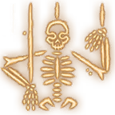 Raise Gargoyle</a>
  </li>
  <li>
    <a href="Death Knight Spells#army-of-the-dead"> 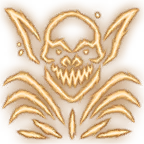 Army of the Dead</a>
  </li>
</ul>

### Level 10

#### Improved Death Coil

{{ get .loca "hef462443g560bg4dadgb97cga30552db67e9" | include "wikify" }}

### Level 11

<h3>
Runes: 
2  Blood, 
2  Frost, 
6  Unholy
</h3>

#### New Rune Spells

<ul>
  <li>
    <a href="Death Knight Spells#apocalypse"> 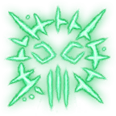 Apocalypse</a>
  </li>
  <li>
    <a href="Death Knight Spells#commander-of-the-dead"> 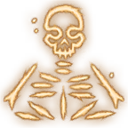 Commander of the Dead</a>
  </li>
</ul>

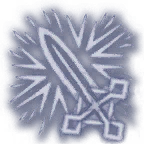

#### Rune Mastery

{{ get .loca "h5f27023dgdd29g4367g9e99g55c414897a3b" | include "wikify" }}

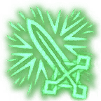

##### Empower Rune Weapon

{{ getf .loca "h1c2be41ag6b58g4651gad3dgf7d097e5f6ca" "1d8 Necrotic damage" | include "wikify" }}

##### Superstrain

{{ getf .loca "h28a2a031g12dfg4b1ag9dc9gd3efc89a38a8" "2" | include "wikify" }}
