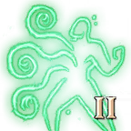
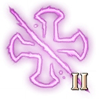
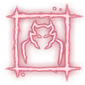

# Unique Spells

## Available at Level 1

### Frost Strike

- {{ "Costs 1 **Action**, 1 Frost Rune on hit" | include "wikify" }}
- Weapon Attack
- {{ getf .loca "h448adaceg9464g44a0g96b4ga01a6f757b7b" "[1d4](## 'Rune Die') Cold damage" "3m" | include "wikify" }}

### Death Strike
- {{ "Costs 1 **Action**, 1 Blood Rune on hit" | include "wikify" }}
- Weapon Attack
- {{ getf .loca "hdf823ca8g47feg4126g96d4gb5c0d30fc627" "[1d4](## 'Rune Die') Force damage" "[2d4](## '2 Rune Die') hit points" "[4](# 'Rune Die Total')" | include "wikify" }}

### Death Coil
- {{ "Costs 1 **Action**, 1 Unholy Rune" | include "wikify" }}
- [Constitution](https://bg3.wiki/wiki/Constitution) [Saving Throw](https://bg3.wiki/wiki/Saving_Throw), Half Damage on Success, 12m Range
- {{ getf .loca "h1f4eae18g1fe5g4567g9b5cg431d4f8d69bf" "[3d4](## '3 Rune Die') Necrotic damage" "[3d4](## '3 Rune Die') hit points" | include "wikify" }}

## Available at Level 2

### Anti-Magic Shell

- {{ "Costs 1 **Action**, 1 Unholy Rune" | include "wikify" }}
- [Concentration](https://bg3.wiki/wiki/Concentration), 10 Turn Duration
- {{ get .loca "h9b4092aegad19g4e7dga2bdg276a27e06c44" | include "wikify" }}

### Death's Advance
- {{ "Costs 1 Bonus Action, 1 Any Rune" | include "wikify" }}
- Lasts 1 Turn
- {{ get .loca "h18aed6bag014dg4573g83c0g23fc5be8a61b" | include "wikify" }}

### Chains of Ice
- {{ "Costs 1 **Action**, 1 Frost Rune" | include "wikify" }}
- {{ "Strength [Saving Throw](https://bg3.wiki/wiki/Saving_Throw), 18m range" | include "wikify" }}
- {{ getf .loca "h2cbcc90dgfe7eg4135g8e2age5096ad6022c" "[3d4](## '3 Rune Die') Cold Damage" | include "wikify" }}

### Death and Decay
- {{ "Costs 1 **Action**, 1 Blood Rune or Unholy Rune" | include "wikify" }}
- [Concentration](https://bg3.wiki/wiki/Concentration), 9m range, 4m radius
- {{ getf .loca "hd707f45cgbf9dg4a99g90a1g23c832c71626" "10" "[1d4](## 'Rune Die') Necrotic Damage" | include "wikify" }}
- {{ get .loca "hf1e437adgc1f8g422bgbcccg6bd1cf63289b" | include "wikify" }}

### Mind Freeze
- {{ "Costs 1 **Action**, 1 Frost Rune" | include "wikify" }}
- {{ "Intelligence [Saving Throw](https://bg3.wiki/wiki/Saving_Throw), 18m range" | include "wikify" }}
- {{ getf .loca "h43a22f0cgca41g4484g9885g6f8214b189ba" "2" | include "wikify" }}

### Path of Frost
- {{ "Costs 1 **Action**, 1 Frost Rune" | include "wikify" }}
- Melee Range, Lasts until Long Rest
- {{ get .loca "hb024f73cg90a2g4044gba91g159407a7654e" | include "wikify" }}

## Available at Level 3

### Death Grip
- {{ "Costs 1 **Action**, 1 Any Rune" | include "wikify" }}
- {{ "Strength [Saving Throw](https://bg3.wiki/wiki/Saving_Throw), 12m range" | include "wikify" }}
- {{ getf .loca "h724b80b8gb3aeg46adgbbe6g586eacb355fa" "2m" | include "wikify" }}
- {{ get .loca "h0b1bb04eg04cbg4eefg8ed8g1920fc40a0c5" | include "wikify" }}

### Sacrificial Pact
- {{ "Costs 1 Bonus Action, 1 Blood Rune" | include "wikify" }}
- 9m Range
- {{ get .loca "h4d2235dagb94ag44b9gabf8g3224be6a4ab2" | include "wikify" }}

### Blood Only

#### Marrowrend
- {{ "Costs 1 **Action**, 2 Blood Runes on hit" | include "wikify" }}
- Weapon Attack
- {{ getf .loca "hc857ea31gb601g4319ga792gedd0bfa96c02" "[2d4](## '2 Rune Die') Force damage" "[8](## '2 Rune Die Total')" | include "wikify" }}

#### Heart Strike
- {{ "Costs 1 **Action**, 1 Blood Rune on hit" | include "wikify" }}
- Weapon Attack
- {{ getf .loca "h242d09f1gf2a0g4466ga270g83af0d3a9545" "[1d4](## 'Rune Die') Force Damage" "[1d4](## 'Rune Die') Force Damage" "3m" | include "wikify" }}

#### Blood Boil
- {{ "Costs 1 **Action**, 1 Blood Rune" | include "wikify" }}
- {{ "**Constitution** [Saving Throw](https://bg3.wiki/wiki/Saving_Throw), 6m radius" | include "wikify" }}
- {{ getf .loca "hf05664efgfe07g4b87ga5e3g64edfc6c1beb" "[1d4](## 'Rune Die') Force Damage" | include "wikify" }}
- Full damage and 5 turn duration on failed save, half damage and 2 turn duration on succeeded save

### Frost Only

#### Howling Blast
- {{ "Costs 1 **Action**, 1 Frost Rune" | include "wikify" }}
- {{ "**Constitution** [Saving Throw](https://bg3.wiki/wiki/Saving_Throw), 9m range, 3m radius" | include "wikify" }}
- {{ getf .loca "hdc82e1f9g7ba0g45e6gaea8gaef3d7f96ef3" "[2d4](## '2 Rune Die') Cold Damage" | include "wikify" }}
- Full damage and 5 turn duration on failed save, half damage and 2 turn duration on succeeded save

#### Obliterate
- {{ "Costs 1 **Action**, 2 Frost Runes on hit" | include "wikify" }}
- Weapon Attack
- {{ getf .loca "hb209a6edg23a1g47b6ga7e6gbda4e4a12921" "[3d4](## '3 Rune Die') Cold damage" | include "wikify" }}
- When dual wielding, instead hits with both weapons for half damage each

#### Frostscythe
- {{ "Costs 1 **Action**, 1 Frost Rune" | include "wikify" }}
- Weapon Attack, 3 targets within cone for half weapon damage
- {{ getf .loca "hba0e3b53ga06bg4ab4g8539gede1fbf0592c" "[1d4](## 'Rune Die') Cold damage" | include "wikify" }}

### Unholy Only

#### Outbreak
- {{ "Costs 1 **Action**, 1 Unholy Rune" | include "wikify" }}
- {{ "**Constitution** [Saving Throw](https://bg3.wiki/wiki/Saving_Throw), 9m range, 3m radius" | include "wikify" }}
- {{ getf .loca "he9edb0feg97e0g45a8ga0a7g24b0561f492c" "[3d4](## '3 Rune Die') Necrotic damage" | include "wikify" }}
- Full damage and 5 turn duration on failed save, half damage and 2 turn duration on succeeded save

#### Festering Strike
- {{ "Costs 1 **Action**, 2 Unholy Runes on hit" | include "wikify" }}
- Weapon Attack
- {{ getf .loca "hd73ab209g0483g498eg9e81g0804c87fa444" "[2d4](## '2 Rune Die') Necrotic Damage" "3" "[2d4](## '2 Rune Die') Necrotic Damage" | include "wikify" }}

#### Scourge Strike
- {{ "Costs 1 **Action**, 1 Unholy Rune on hit" | include "wikify" }}
- Weapon Attack
- {{ getf .loca "ha55ed165g6ad3g44f9g8187g7a5deaf8f048" "[1d4](## '1 Rune Die') Necrotic Damage" "[1d4](## '1 Rune Die') Necrotic Damage" | include "wikify" }}

## Available at Level 7

### Anti-Magic Zone
- {{ "Costs 1 **Action**, 2 Any Runes" | include "wikify" }}
- [Concentration](https://bg3.wiki/wiki/Concentration), 9m range, 3m radius
- {{ get .loca "h95b2897ag4a39g48cfgb08agcb66b6c47b16" | include "wikify" }}

## Available at Level 9

### Dark Transformation
- {{ "Costs 1 **Action**, 4 Unholy Runes" | include "wikify" }}
- 3m range
- {{ getf .loca "h15eda73bg9db5g4735g9c14g4afa7ce57766" | include "wikify" }}
  - [Zombie](https://bg3.wiki/wiki/Zombie) -> [Ghoul](https://bg3.wiki/wiki/Ghoul_(Animate_Dead))
  - [Skeleton](https://bg3.wiki/wiki/Skeleton_(Animate_Dead)) -> [Flying Ghoul](https://bg3.wiki/wiki/Flying_Ghoul_(Animate_Dead))
  - [Ghoul](https://bg3.wiki/wiki/Ghoul_(Animate_Dead))/[Flying Ghoul](https://bg3.wiki/wiki/Flying_Ghoul_(Animate_Dead)) -> [Mummy](https://bg3.wiki/wiki/Ancient_Servant)

## Diseases

### Blood Plague
- {{getf .loca "ha1224b6cg481eg420bgaa13g359e598f75fa" "[1d4](## 'Rune Die')Force damage" | include "wikify" }}

### Frost Fever
- {{ getf .loca "ha8710349g043dg4faagabfag7c66d34d137a" "3m" "[1d4](## 'Rune Die')Cold damage" | include "wikify" }}

### Virulent Plague
- {{ getf .loca "h5a6cf0adg5981g4624g8423g06ca6dd13f80" "[1d4](## 'Rune Die')Necrotic damage" "[1d4](## 'Rune Die')Necrotic damage" "3m" | include "wikify" }}

### Festering Wound
- {{ getf .loca "h2354ebe6gb628g4bf6g92f9g8fc7bbbfe739" "[2d4](## 'Rune Die')Necrotic damage" | include "wikify" }}

## Existing Spells

### 1 Rune

#### Armour of Arthas
- {{ "Costs 1 **Action**, 1 Frost Rune" | include "wikify" }}
- Cast [Armour of Agathys](https://bg3.wiki/wiki/Armour_of_Agathys) as a 1st level "spell"

#### Abomination Limb
- {{ "Costs 1 **Action**, 1 Unholy Rune" | include "wikify" }}
- Cast [Arms of Hadar](https://bg3.wiki/wiki/Arms_of_Hadar) as a 1st level "spell"

#### Gloom Ward

- {{ "Costs 1 **Action**, 1 Blood Rune" | include "wikify" }}
- Cast [False Life](https://bg3.wiki/wiki/False_Life) as a 1st level "spell"

#### Scourge
- {{ "Costs 1 **Action**, 1 Any Rune" | include "wikify" }}
- Cast [Bane](https://bg3.wiki/wiki/Bane_(Spell)) as 1st Level Spell

#### Dark Command
- {{ "Costs 1 **Action**, 1 Blood Rune" | include "wikify" }}
- Cast [Command](https://bg3.wiki/wiki/Command) as a 1st level "spell"
  - Also works on Undead

#### Evenly Matched
- {{ "Costs 1 Bonus Action, 1 Blood Rune" | include "wikify" }}
- Cast [Compelled Duel](https://bg3.wiki/wiki/Compelled_Duel) as a 1st level "spell"

### 2 Rune

#### Dancing Rune Weapon
- {{ "Costs 1 Bonus Action, 2 Blood Runes" | include "wikify" }}
- Cast [Spiritual Weapon](https://bg3.wiki/wiki/Spiritual_Weapon) as a 2nd level "spell"

#### Subduing Grasp: Person
- {{ "Costs 1 **Action**, 2 Blood Runes" | include "wikify" }}
- Cast [Hold Person](https://bg3.wiki/wiki/Hold_Person) as a 2nd level "spell"

#### Enfeeble
- {{ "Costs 1 **Action**, 2 Unholy Runes" | include "wikify" }}
- Cast [Ray of Enfeeblement](https://bg3.wiki/wiki/Ray_of_Enfeeblement) as a 2nd level "spell"

#### Raise Ally
- {{ "Costs 1 **Action**, 2 Unholy Runes" | include "wikify" }}
- Cast [Revivify](https://bg3.wiki/wiki/Revivify) as a 3rd level "spell"

### 3 Rune

#### Raise Dead
- {{ "Costs 1 **Action**, 2 Unholy Runes per corpse" | include "wikify" }}
- Cast [Animate Dead](https://bg3.wiki/wiki/Animate_Dead) as a 2nd level "spell"

#### San'layn Touch
- {{ "Costs 1 **Action**, 2 Blood Runes, 1 Unholy Rune" | include "wikify" }}
- Cast [Vampiric Touch](https://bg3.wiki/wiki/Vampiric_Touch) as a 3rd level "spell"

#### Absolute Zero
- {{ "Costs 1 **Action**, 2 Frost Runes, 1 Unholy Rune" | include "wikify" }}
- Cast [Hunger of Hadar](https://bg3.wiki/wiki/Hunger_of_Hadar) as a 3rd level "spell"

#### Unholy Aura
- {{ "Costs 1 **Action**, 3 Unholy Runes" | include "wikify" }}
- Cast [Spirit Guardians (Necrotic)](https://bg3.wiki/wiki/Spirit_Guardians_(Necrotic)) as a 3rd level "spell"

### 4 Rune

#### Avalanche
- {{ "Costs 1 **Action**, 4 Frost Runes" | include "wikify" }}
- Cast [Ice Storm](https://bg3.wiki/wiki/Ice_Storm) as a 4th level "spell"
  

#### Defile
- {{ "Costs 1 **Action**, 4 Unholy Runes" | include "wikify" }}
- Cast [Blight](https://bg3.wiki/wiki/Blight) as a 4th level "spell"

#### Raise Gargoyle
- {{ "Costs 1 **Action**, 4 Unholy Runes" | include "wikify" }}
- Cast [Animate Dead: Flying Ghoul](https://bg3.wiki/wiki/Animate_Dead:_Flying_Ghoul) as a 5th level "spell"

### 5 Rune

#### Subduing Grasp: Monster
- {{ "Costs 1 **Action**, 5 Blood Runes" | include "wikify" }}
- Cast [Hold Monster](https://bg3.wiki/wiki/Hold_Monster) as a 5th level "spell"

#### Breath of Sindragosa
- {{ "Costs 1 **Action**, 5 Frost Runes" | include "wikify" }}
- Cast [Cone of Cold](https://bg3.wiki/wiki/Cone_of_Cold) as a 5th level "spell"

#### Army of the Dead
- {{ "Costs 1 **Action**, 5 Unholy Runes" | include "wikify" }}
- Cast [Danse Macabre](https://bg3.wiki/wiki/Danse_Macabre) as a 5th level "spell"

### 6 Rune

#### Bloodshot
- {{ "Costs 1 **Action**, 6 Blood Runes" | include "wikify" }}
- Cast [Eyebite](https://bg3.wiki/wiki/Eyebite) as a 6th level "spell"

#### Glacial Advance
- {{ "Costs 1 **Action**, 6 Frost Runes" | include "wikify" }}
- Cast [Wall of Ice](https://bg3.wiki/wiki/Wall_of_Ice) as a 6th level "spell"

#### Apocalypse
- {{ "Costs 1 **Action**, 6 Unholy Runes" | include "wikify" }}
- Cast [Circle of Death](https://bg3.wiki/wiki/Circle_of_Death) as a 6th level "spell"

#### Commander of the Dead
- {{ "Costs 1 **Action**, 6 Unholy Runes" | include "wikify" }}
- Cast [Create Undead](https://bg3.wiki/wiki/Create_Undead) as a 6th level "spell"
