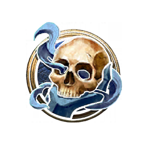
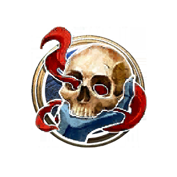
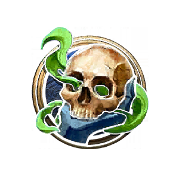
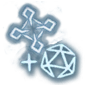
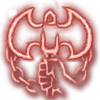
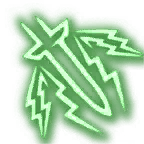

**Death Knight** is a new character class added in this mod adapted from the World of Warcraft class of the same name. I was inspired to create this by [VivaSortiara](https://www.nexusmods.com/baldursgate3/users/187617384)'s [Death Knight Class](https://www.nexusmods.com/baldursgate3/mods/1725) mod. I liked some of their ideas but personally wanted a version that was changed more significantly from WoW to more match the mechanics and vibes of BG3 / DnD 5e Classes. This included things like not having a 0-100 resource like Runic Power, not having direct percentage proc chances, using actual BG3 art style for all the icons, incorporating existing 5e spells, etc.

The end result is a Martial class that can utilize it's unique Rune resource to empower its attacks or to cast powerful spells. It has the most overall similarity with Paladin, Warlock, and Way of the Four Elements Monk.

Death Knights use Strength (or Dexterity) for their attacks, and Intelligence for their casting.

<h3>

> {{ get .loca "h53fbfa3dgcb23g45c5gb3c3g94e7dbd69fde" | quote }}

</h3>

The Death Knight subclasses are:

<h3>
<a href="Death Knight - Blood">Blood</a>
&nbsp;⋅
<a href="Death Knight - Frost">Frost</a>
&nbsp;⋅
<a href="Death Knight - Unholy">Unholy</a>
</h3>

<table>
  <tbody>
    <tr>
      <th colspan="42">
Death Knight Class Progression
</th>
    </tr>
    <tr>
      <th>
Level
</th>
      <th>
Proficiency Bonus
</th>
      <th>
Features
</th>
      <th>
Spells Known
</th>
      <th>
1st Rune
</th>
      <th>
2nd Rune
</th>
      <th>
3rd Rune
</th>
      <th>
Rune Die
</th>
    </tr>
    <tr>
      <td><a href="#level-1">1st</a></td>
      <td rowspan="4">
+2
</td>
      <td>
        <a href="#rune-casting">Rune Casting</a>,
        <a href="#level-1">  Lichborne</a>
      </td>
      <td>
-
</td>
      <td>
1
</td>
      <td>
1
</td>
      <td>
1
</td>
      <td rowspan="3">
1d4
</td>
    </tr>
    <tr>
      <td><a href="#level-2">2nd</a></td>
      <td>
        <a href="https://bg3.wiki/wiki/Fighting_Stylye">Fighting Style</a>,
        <a href="#runeforging">  Runeforging</a>
      </td>
      <td>
2
</td>
      <td>
1
</td>
      <td>
1
</td>
      <td>
1
</td>
    </tr>
    <tr>
      <td><a href="#level-3">3rd</a></td>
      <td>
        <a href="#level-3">  Choose a subclass</a>
      </td>
      <td>
3
</td>
      <td>
2
</td>
      <td>
1
</td>
      <td>
1
</td>
    </tr>
    <tr>
      <td><a href="#level-4">4th</a></td>
      <td>
        <a href="https://bg3.wiki/wiki/Feat">  Feat</a>,
        <a href="#level-4">  Subclass Feature</a>
      </td>
      <td>
4
</td>
      <td>
2
</td>
      <td>
1
</td>
      <td>
1
</td>
      <td rowspan="3">
1d6
</td>
    </tr>
    <tr>
      <td><a href="#level-5">5th</a></td>
      <td rowspan="4">
+3
</td>
      <td>
        <a href="https://bg3.wiki/wiki/Extra_Attack">  Extra Attack</a>
      </td>
      <td>
5
</td>
      <td>
3
</td>
      <td>
1
</td>
      <td>
1
</td>
    </tr>
    <tr>
      <td><a href="#level-6">6th</a></td>
      <td>
        <a href="#level-6">  Subclass Feature</a>
      </td>
      <td>
6
</td>
      <td>
3
</td>
      <td>
1
</td>
      <td>
1
</td>
    </tr>
    <tr>
      <td><a href="#level-7">7th</a></td>
      <td>
        <a href="#rune-tap">  Rune Tap</a>
      </td>
      <td>
7
</td>
      <td>
4
</td>
      <td>
2
</td>
      <td>
2
</td>
      <td rowspan="3">
1d8
</td>
    </tr>
    <tr>
      <td><a href="#level-8">8th</a></td>
      <td>
        <a href="https://bg3.wiki/wiki/Feat">  Feat</a>
      </td>
      <td>
8
</td>
      <td>
4
</td>
      <td>
2
</td>
      <td>
2
</td>
    </tr>
    <tr>
      <td><a href="#level-9">9th</a></td>
      <td rowspan="4">
+4
</td>
      <td> 
        <a href="#will-of-the-necropolis">  Will of the Necropolis</a> 
      </td>
      <td>
9
</td>
      <td>
5
</td>
      <td>
2
</td>
      <td>
2
</td>
    </tr>
    <tr>
      <td><a href="#level-10">10th</a></td>
      <td>
        <a href="#level-10">  Subclass Feature</a>
      </td>
      <td>
10
</td>
      <td>
6
</td>
      <td>
2
</td>
      <td>
2
</td>
      <td rowspan="3">
1d10
</td>
    </tr>
    <tr>
      <td><a href="#level-11">11th</a></td>
      <td>
        <a href="#rune-mastery">  Rune Mastery</a>
      </td>
      <td>
11
</td>
      <td>
6
</td>
      <td>
2
</td>
      <td>
2
</td>
    </tr>
    <tr>
      <td><a href="#level-12">12th</a></td>
      <td>
        <a href="https://bg3.wiki/wiki/Feat">  Feat</a>
      </td>
      <td>
12
</td>
      <td>
6
</td>
      <td>
2
</td>
      <td>
2
</td>
    </tr>
  </tbody>
</table>

**Note**: [Proficiency bonus](https://bg3.wiki/wiki/Proficiency_bonus) is based on [character level](https://bg3.wiki/wiki/Character_level), not class level. It's included in the table for convenience.

# Class Information

**Hit pints**

- At level 1: `10 + CON Modifier`
- On level up: `6 + CON Modifier`

**Key abilities**

- [  Strength](https://bg3.wiki/wiki/Strength) or [  Dexterity](https://bg3.wiki/wiki/Dexterity) for physical attacks
- [  Intelligence](https://bg3.wiki/wiki/Intelligence) for Rune Spell DCs and Attack Rolls
- [  Constitution](https://bg3.wiki/wiki/Constitution) for Hit Points and [  Concentration](https://bg3.wiki/wiki/Concentration) Checks

**Saving Throw Proficiencies**
- [  Constitution](https://bg3.wiki/wiki/Constitution), [  Intelligence](https://bg3.wiki/wiki/Intelligence)

**Equipment proficiencies**
- [  Simple weapons](https://bg3.wiki/wiki/Simple_weapons), [  Martial weapons](https://bg3.wiki/wiki/Martial_weapons)
- [  Light armour](https://bg3.wiki/wiki/Armour#List_of_light_armour), [  Medium armour](https://bg3.wiki/wiki/Armour#List_of_medium_armour), [  Heavy armour](https://bg3.wiki/wiki/Armour#List_of_heavy_armour)

**Skills with proficiency (Choose 2)**
- [  Athletics](https://bg3.wiki/wiki/Athletics), [  Deception](https://bg3.wiki/wiki/Deception), [  Intimidation](https://bg3.wiki/wiki/Intimidation), [  Perception](https://bg3.wiki/wiki/Perception), [  Sleight of Hand](https://bg3.wiki/wiki/Sleight_Of_Hand), [  Survival](https://bg3.wiki/wiki/Athletics)

**Starting Equipment**
-  {{ get .loca "hd23a3240g5445g4f23g923fg16b6cb121258" }},
   {{ get .loca "hb2c30a75g3fb5g4642g92c3gd83694b7b82d" }}, 
   {{ get .loca "h8c149768gf29fg4699g91d3g67e953236b3d" }}, 
   {{ get .loca "h8b40104eg7963g4426gb2efgde604c08d5c6" }}

### Rune Casting

*For a list of rune spells available to the Death Knight, see [List of Death Knight Spells](Death-Knight-Spells)*

**Spellcasting Ability**

- [Intelligence](https://bg3.wiki/wiki/Intelligence)

**Known spells**

- Death Knight Spells are Always Prepared. In exchange, Death Knights know fewer Spells at low levels.

**Rune Casting**
- Instead of spell slots, Death Knights use  Blood,  Frost, and  Unholy Runes to cast rune "spells"[*](# "Like Way of the Four Elements 'spells', these do not have the `IsSpell` tag and are instead considered Class Actions.").
- Death Knights have a limited number of Runes, but regain them by taking a [Short Rest](https://bg3.wiki/wiki/Short_Rest) or [Long Rest](https://bg3.wiki/wiki/Long_Rest).
- Death Knights learn higher level spells than other Martial/Caster hybrids, but they can't use them as often.

# Level Information

## Level 1

### Rune Die: 1d4

### Runes: 1  Blood, 1  Frost, 1  Unholy

### Initial Rune Spells

<a href="Death Knight Spells#death-strike">  Death Strike</a>,
<a href="Death Knight Spells#frost-Strike">  Frost Strike</a>,
<a href="Death Knight Spells#feath-Coil">  Death Coil</a>

### Lichborne

{{ get .loca "hd2638eddg73ccg4effgbb1ag62cd837b48cb" }}

*Note: This passive is not learned when [Multiclassing](https://bg3.wiki/wiki/Classes#Multiclassing) into Death Knight--only if you are a Death Knight at Level 1*

## Level 2

[**Fighting Style**](https://bg3.wiki/wiki/Fighting_Style)
- [  Defence](https://bg3.wiki/wiki/Defence)
  - You gain a +1 bonus to [  Armour Class](https://bg3.wiki/wiki/Armour_Class) while wearing [Armour](https://bg3.wiki/wiki/Armour).
- [  Great Weapon Fighting](https://bg3.wiki/wiki/Great_Weapon_Fighting)
  - When you roll a 1 or 2 on a damage die for an attack with a **Two-Handed** melee weapon, that die is rerolled once.
- [  Two-Weapon Fighting](https://bg3.wiki/wiki/Two-Weapon_Fighting)
  - When you make an offhand attack, you can add your [Ability Modifier](https://bg3.wiki/wiki/Ability_Modifier) to the damage of the attack.

### Runeforging

{{ get .loca "h1dcb24acg6d03g4a45gbe65g9689080eb3e3" }}

{{ get .loca "ha1bbf1f9g9007g4e3egb11eg12b7d78976d5" | replace "Runeblades" "[Runeblades](#runeblades)" }}

#### Rune of Razorice

{{ getf .loca "ha7dc3e14gc3b1g47c7gb454g5a2ca7ff2988" "1  Cold damage" }}

#### Rune of the Fallen Crusader

{{ getf .loca "hf14f6741g6c07g4322ga0edg5bb580209a8b" "1  hit point" }}

#### Rune of the Stoneskin Gargoyle

{{ getf .loca "h2bd24ad6gf5c5g4ecag8e1cgf4e281da8d22" "1" | replace "Armour Class" "[Armour Class](https://bg3.wiki/wiki/Armour_Class)" }}

#### Runeblades

The Death Knight starter longsword "Runed Soulblade" is a special weapon classified as a **Runeblade**.

{{get .loca "h2e8654a0g6056g4b96ga4f0g96338c13ad56" }}

**More Runeblades may be added in the future**

### Rune Spells Known: 2

- Choose 2 Rune Spells from the <a href ="Death Knight Spells">Death Knight Spell List</a>.

### New Rune Spells

<a href="Death Knight Spells#anti-Magic-Shell">  Anti-Magic Shell</a>,
<a href="Death Knight Spells#armor-of-Arthas">  Armour of Arthas</a>,
<a href="Death Knight Spells#abomination-Limb">  Abomination Limb</a>,
<a href="Death Knight Spells#deaths-advance">  Death's Advance</a>,
<a href="Death Knight Spells#gloom-ward">  Gloom Ward</a>,
<a href="Death Knight Spells#scourge">  Scourge</a>,
<a href="Death Knight Spells#chains-of-ice">  Chains of Ice</a>,
<a href="Death Knight Spells#dark-command">  Dark Command</a>,
<a href="Death Knight Spells#evenly-matched">  Evenly Matched</a>,
<a href="Death Knight Spells#death-and-decay">  Death and Decay</a>,
<a href="Death Knight Spells#mind-Freeze">  Mind Freeze</a>,
<a href="Death Knight Spells#path-of-frost">  Path of Frost</a>

## Level 3

### Rune Spells Known: 3

- Choose 1 additional Rune Spell from the <a href ="Death Knight Spells">Death Knight Spell List</a>.
- Optionally, choose 1 known Rune Spell and replace it with another in the <a href ="Death Knight Spells">Death Knight Spell List</a>.

### New Rune Spells

<a href="Death Knight Spells#death-grip">  Death Grip</a>,
<a href="Death Knight Spells#sacrificial-pact">  Sacrificial Pact</a>

### Select a subclass

<table>
  <tbody>
    <tr>
      <th>
        

          
           
          <a href="Death Knight - Blood">Blood</a>
        

      </th>
      <th>
        

        
           
          <a href="Death Knight - Frost">Frost</a>
        

      </th>
      <th>
        

        
           
          <a href="Death Knight - Unholy">Unholy</a>
        

      </th>
    </tr>
    <tr>
      <td>
        <ul>
          <li>
            +1  Blood Rune
          </li>
          <li>
            Known Rune Spells:
            <ul>
              <li>
                <a href="Death Knight Spells#blood-boil">  Blood Boil</a>
              </li>
              <li>
                <a href="Death Knight Spells#marrowrend">  Marrowrend</a>
              </li>
              <li>
                <a href="Death Knight Spells#heart-Strike">  Heart Strike</a>
              </li>
            </ul>
          </li>
          <li>
            New Rune Spells:
            <ul>
              <li>
                <a href="Death Knight Spells#dancing-rune-weapon">  Dancing Rune Weapon</a>
              </li>
              <li>
                <a href="Death Knight Spells#subduing-grasp-person">  Subduing Grasp: Person</a>
              </li>
            </ul>
          </li>
        </ul>
      </td>
      <td>
        <ul>
          <li>
            +1  Frost Rune
          </li>
          <li>
            Known Rune Spells:
            <ul>
              <li>
                <a href="Death Knight Spells#howling-blast">  Howling Blast</a>
              </li>
              <li>
                <a href="Death Knight Spells#obliterate">  Obliterate</a>
              </li>
              <li>
                <a href="Death Knight Spells#frostscythe">  Frostscythe</a>
              </li>
            </ul>
          </li>
        </ul>
      </td>
      <td>
        <ul>
          <li>
            +1  Unholy Rune
          </li>
          <li>
            Known Rune Spells:
            <ul>
              <li>
                <a href="Death Knight Spells#outbreak">  Outbreak</a>
              </li>
              <li>
                <a href="Death Knight Spells#festering-strike">  Festering Strike</a>
              </li>
              <li>
                <a href="Death Knight Spells#scourge-strike">  Scourge Strike</a>
              </li>
            </ul>
          </li>
          <li>
            New Rune Spells:
            <ul>
              <li>
                <a href="Death Knight Spells#enfeeble">  Enfeeble</a>
              </li>
            </ul>
          </li>
        </ul>
      </td>
    </tr>
  </tbody>
</table>

## Level 4

### Choose a [Feat](https://bg3.wiki/wiki/Feat).

### Rune Die: 1d6

### Rune Spells Known: 4

- Choose 1 additional Rune Spell from the <a href ="Death Knight Spells">Death Knight Spell List</a>.
- Optionally, choose 1 known Rune Spell and replace it with another in the <a href ="Death Knight Spells">Death Knight Spell List</a>.

### Subclass feature

<table>
  <tbody>
    <tr>
      <th>
        

          <a href="Death Knight - Blood">Blood</a>
        

      </th>
      <th>
        

          <a href="Death Knight - Frost">Frost</a>
        

      </th>
      <th>
        

          <a href="Death Knight - Unholy">Unholy</a>
        

      </th>
    </tr>
    <tr>
      <td>
        <ul>
          <li>
            <a href="Death Knight - Bloodblood-shield">  Blood Shield</a>
          </li>
        </ul>
      </td>
      <td>
        <ul>
          <li>
            <a href="Death Knight - Frost#frozen-heart">  Frozen Heart</a>
          </li>
        </ul>
      </td>
      <td>
        <ul>
          <li>
            <a href="Death Knight - Unholy#dreadblade">  Dreadblade</a>
          </li>
        </ul>
      </td>
    </tr>
  </tbody>
</table>

## Level 5

<h3><a href="https://bg3.wiki/wiki/Extra_Attack">

Extra Attack
</a></h3>

- You can attack twice, instead of once, whenever you take the Attack action on your turn.

### Rune Spells Known: 5

- Choose 1 additional Rune Spell from the <a href ="Death Knight Spells">Death Knight Spell List</a>.
- Optionally, choose 1 known Rune Spell and replace it with another in the <a href ="Death Knight Spells">Death Knight Spell List</a>.

### Subclass feature

<table>
  <tbody>
    <tr>
      <th>
        

          <a href="Death Knight - Blood">Blood</a>
        

      </th>
      <th>
        

          <a href="Death Knight - Frost">Frost</a>
        

      </th>
      <th>
        

          <a href="Death Knight - Unholy">Unholy</a>
        

      </th>
    </tr>
    <tr>
      <td>
        <ul>
          <li>
            +1  Blood Rune
          </li>
          <li>
            New Rune Spells:
            <ul>
              <li>
                <a href="Death Knight Spells#sanlayn-touch">  San'layn Touch</a>
              </li>
            </ul>
          </li>
        </ul>
      </td>
      <td>
        <ul>
          <li>
            +1  Frost Rune
          </li>
          <li>
            New Rune Spells:
            <ul>
              <li>
                <a href="Death Knight Spells#absolute-zero">  Absolute Zero</a>
              </li>
            </ul>
          </li>
        </ul>
      </td>
      <td>
        <ul>
          <li>
            +1  Unholy Rune
          </li>
          <li>
            New Rune Spells:
            <ul>
              <li>
                <a href="Death Knight Spells#raise-ally">  Raise Ally</a>
              </li>
              <li>
                <a href="Death Knight Spells#unholy-aura">  Unholy Aura</a>
              </li>
              <li>
                <a href="Death Knight Spells#raise-Dead">  Raise Dead</a>
              </li>
            </ul>
          </li>
        </ul>
      </td>
    </tr>
  </tbody>
</table>

## Level 6

### Rune Spells Known: 6

- Choose 1 additional Rune Spell from the <a href ="Death Knight Spells">Death Knight Spell List</a>.
- Optionally, choose 1 known Rune Spell and replace it with another in the <a href ="Death Knight Spells">Death Knight Spell List</a>.

### Subclass feature

<table>
  <tbody>
    <tr>
      <th>
        

          <a href="Death Knight - Blood">Blood</a>
        

      </th>
      <th>
        

          <a href="Death Knight - Frost">Frost</a>
        

      </th>
      <th>
        

          <a href="Death Knight - Unholy">Unholy</a>
        

      </th>
    </tr>
    <tr>
      <td>
        <ul>
          <li>
            <a href="Death Knight - Blood#dark-succor">  Dark Succor</a>
          </li>
        </ul>
      </td>
      <td>
        <ul>
          <li>
            <a href="Death Knight - Frost#rime">  Rime</a>
          </li>
        </ul>
      </td>
      <td>
        <ul>
          <li>
            <a href="Death Knight - Unholy#sudden-doom">  Sudden Doom</a>
          </li>
        </ul>
      </td>
    </tr>
  </tbody>
</table>

## Level 7

### Rune Die: 1d8

### Rune Spells Known: 7

- Choose 1 additional Rune Spell from the <a href ="Death Knight Spells">Death Knight Spell List</a>.
- Optionally, choose 1 known Rune Spell and replace it with another in the <a href ="Death Knight Spells">Death Knight Spell List</a>.

### Additional Runes: +1  Blood, +1  Frost, +1  Unholy

### New Rune Spells

<a href="Death Knight Spells#anti-magic-zone">  Anti-Magic Zone</a>,
<a href="Death Knight Spells#dark-transformation">  Dark Transformation</a>,
<a href="Death Knight Spells#taise-ally">  Raise Ally</a>,
<a href="Death Knight Spells#sanlayn-touch">  San'layn Touch</a>,
<a href="Death Knight Spells#absolute-zero">  Absolute Zero</a>

<table>
  <tbody>
    <tr>
      <th>
        

          <a href="Death Knight - Blood">Blood</a>
        

      </th>
      <th>
        

          <a href="Death Knight - Frost">Frost</a>
        

      </th>
      <th>
        

          <a href="Death Knight - Unholy">Unholy</a>
        

      </th>
    </tr>
    <tr>
      <td>
        (none)
      </td>
      <td>
        New Rune Spells:
        <ul>
          <li>
            <a href="Death Knight Spellsavalanche">  Avalanche</a>
          </li>
        </ul>
      </td>
      <td>
        New Rune Spells:
        <ul>
          <li>
            <a href="Death Knight Spellsdark-transformation">  Dark Transformation</a>
          </li>
          <li>
            <a href="Death Knight Spells#raise-gargoyle">  Raise Gargoyle</a>
          </li>
          <li>
            <a href="Death Knight Spells#defile">  Defile</a>
          </li>
        </ul>
      </td>
    </tr>
  </tbody>
</table>

### Rune Tap

{{ get .loca "hd1e4ba78g33deg446cg9262g11118d6283cd" }}

## Level 8

### Choose a [Feat](https://bg3.wiki/wiki/Feat).

### Rune Spells Known: 8

- Choose 1 additional Rune Spell from the <a href ="Death Knight Spells">Death Knight Spell List</a>.
- Optionally, choose 1 known Rune Spell and replace it with another in the <a href ="Death Knight Spells">Death Knight Spell List</a>.

## Level 9

### Rune Spells Known: 9

- Choose 1 additional Rune Spell from the <a href ="Death Knight Spells">Death Knight Spell List</a>.
- Optionally, choose 1 known Rune Spell and replace it with another in the <a href ="Death Knight Spells">Death Knight Spell List</a>.

### Subclass feature

<table>
  <tbody>
    <tr>
      <th>
        

          <a href="Death Knight - Blood">Blood</a>
        

      </th>
      <th>
        

          <a href="Death Knight - Frost">Frost</a>
        

      </th>
      <th>
        

          <a href="Death Knight - Unholy">Unholy</a>
        

      </th>
    </tr>
    <tr>
      <td>
        <ul>
          <li>
            +1  Blood Rune
          </li>
          <li>
            New Rune Spells:
            <ul>
              <li>
                <a href="Death Knight Spells#subduing-grasp-monster">  Subduing Grasp: Monster</a>
              </li>
            </ul>
          </li>
        </ul>
      </td>
      <td>
        <ul>
          <li>
            +1  Frost Rune
          </li>
          <li>
            New Rune Spells:
            <ul>
              <li>
                <a href="Death Knight Spells#breath-of-sindragosa">  Breath of Sindragosa</a>
              </li>
            </ul>
          </li>
        </ul>
      </td>
      <td>
        <ul>
          <li>
            +1  Unholy Rune
          </li>
          <li>
            New Rune Spells:
            <ul>
              <li>
                <a href="Death Knight Spells#army-of-the-dead">  Army of the Dead</a>
              </li>
            </ul>
          </li>
        </ul>
      </td>
    </tr>
  </tbody>
</table>

### Will of the Necropolis

{{ get .loca "hf65fbb88g1d96g4034ga675g45612b6c7d46" }}

## Level 10

### Rune Die: 1d10

### Rune Spells Known: 10

- Choose 1 additional Rune Spell from the <a href ="Death Knight Spells">Death Knight Spell List</a>.
- Optionally, choose 1 known Rune Spell and replace it with another in the <a href ="Death Knight Spells">Death Knight Spell List</a>.

### Subclass feature

<table>
  <tbody>
    <tr>
      <th>
        

          <a href="Death Knight - Blood">Blood</a>
        

      </th>
      <th>
        

          <a href="Death Knight - Frost">Frost</a>
        

      </th>
      <th>
        

          <a href="Death Knight - Unholy">Unholy</a>
        

      </th>
    </tr>
    <tr>
      <td>
        <ul>
          <li>
            <a href="Death Knight - Blood#crimson-scourge">  Crimson Scourge</a>
          </li>
        </ul>
      </td>
      <td>
        <ul>
          <li>
            <a href="Death Knight - Frost#killing-machine">  Killing Machine</a>
          </li>
        </ul>
      </td>
      <td>
        <ul>
          <li>
            <a href="Death Knight - Unholy#improved-death-coil">  Improved Death Coil</a>
          </li>
        </ul>
      </td>
    </tr>
  </tbody>
</table>

## Level 11

### Rune Spells Known: 11

- Choose 1 additional Rune Spell from the <a href ="Death Knight Spells">Death Knight Spell List</a>.
- Optionally, choose 1 known Rune Spell and replace it with another in the <a href ="Death Knight Spells">Death Knight Spell List</a>.

### Rune Mastery

Each subclass chooses one of it options for a new passive feature.

<table>
  <tbody>
    <tr>
      <th>
        

          <a href="Death Knight - Blood">Blood</a>
        

      </th>
      <th>
        

          <a href="Death Knight - Frost">Frost</a>
        

      </th>
      <th>
        

          <a href="Death Knight - Unholy">Unholy</a>
        

      </th>
    </tr>
    <tr>
      <td>
        <ul>
          <li>
            <a href="Death Knight - Blood#empower-rune-weapon">  Empower Rune Weapon</a>
          </li>
          <li>
            <a href="Death Knight - Blood#carnage">  Carnage </a>
          </li>
        </ul>
      </td>
      <td>
        <ul>
          <li>
            <a href="Death Knight - Frost#empower-rune-weapon">  Empower Rune Weapon </a>
          </li>
          <li>
            <a href="Death Knight - Frost#obliteration">  Obliteration</a>
          </li>
        </ul>
      </td>
      <td>
        <ul>
          <li>
            <a href="Death Knight - Unholy#empowe-rune-weapon">  Empower Rune Weapon</a>
          </li>
          <li>
            <a href="Death Knight - Unholy#superstrain">  Superstrain </a>
          </li>
        </ul>
      </td>
    </tr>
  </tbody>
</table>

### Subclass feature

<table>
  <tbody>
    <tr>
      <th>
        

          <a href="Death Knight - Blood">Blood</a>
        

      </th>
      <th>
        

          <a href="Death Knight - Frost">Frost</a>
        

      </th>
      <th>
        

          <a href="Death Knight - Unholy">Unholy</a>
        

      </th>
    </tr>
    <tr>
      <td>
        <ul>
          <li>
            +1  Blood Rune
          </li>
          <li>
            New Rune Spells:
            <ul>
              <li>
                <a href="Death Knight Spells#bloodshot">  Bloodshot</a>
              </li>
            </ul>
          </li>
        </ul>
      </td>
      <td>
        <ul>
          <li>
            +1  Frost Rune
          </li>
          <li>
            New Rune Spells:
            <ul>
              <li>
                <a href="Death Knight Spells#glacial-advance">  Glacial Advance</a>
              </li>
            </ul>
          </li>
        </ul>
      </td>
      <td>
        <ul>
          <li>
            +1  Unholy Rune
          </li>
          <li>
            New Rune Spells:
            <ul>
              <li>
                <a href="Death Knight Spells#apocalypse">  Apocalypse</a>
              </li>
              <li>
                <a href="Death Knight Spells#commander-of-the-dead">  Commander of the Dead</a>
              </li>
            </ul>
          </li>
        </ul>
      </td>
    </tr>
  </tbody>
</table>

## Level 12

### Choose a [Feat](https://bg3.wiki/wiki/Feat).

### Rune Spells Known: 12

- Choose 1 additional Rune Spell from the <a href ="Death Knight Spells">Death Knight Spell List</a>.
- Optionally, choose 1 known Rune Spell and replace it with another in the <a href ="Death Knight Spells">Death Knight Spell List</a>.
