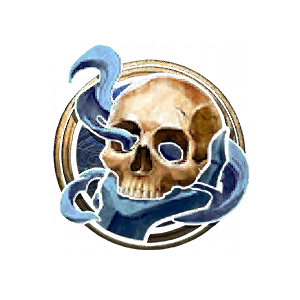
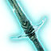
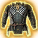
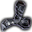
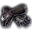
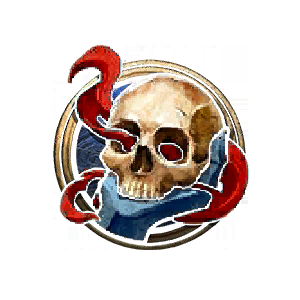
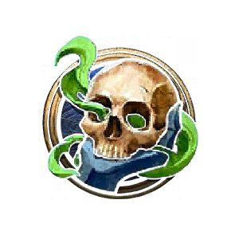

# Death Knight

**Death Knight** is a new character class added in this mod adapted from the World of Warcraft class of the same name. I was inspired to create this by [VivaSortiara](https://www.nexusmods.com/baldursgate3/users/187617384)'s [Death Knight Class](https://www.nexusmods.com/baldursgate3/mods/1725) mod. I liked some of their ideas but personally wanted a version that was changed more significantly from WoW to more match the mechanics and vibes of BG3 / DnD 5e Classes. This included things like not having a 0-100 resource like Runic Power, not having direct percentage proc chances, using actual BG3 art style for all the icons, incorporating existing 5e spells, etc.

The end result is a Martial class that can utilize it's unique Rune resource to empower its attacks or to cast powerful spells. It has the most overall similarity with Paladin, Warlock, and Way of the Four Elements Monk.

Death Knights use Strength (or Dexterity) for their attacks, and Intelligence for their casting.

<h3>

> {{ get .loca "h53fbfa3dgcb23g45c5gb3c3g94e7dbd69fde" | quote }}

</h3>

The Death Knight subclasses are:

<h3>
[[Blood | Death Knight - Blood]]
&nbsp;⋅
[[Frost | Death Knight - Frost]]
&nbsp;⋅
[[Unholy | Death Knight - Unholy]]
</h3>

<table>
  <tbody>
    <tr>
      <th colspan="42">
Death Knight Class Progression
</th>
    </tr>
    <tr>
      <th>
Level
</th>
      <th>
Proficiency Bonus
</th>
      <th>
Features
</th>
      <th>
Spells Known
</th>
      <th>
1st Rune
</th>
      <th>
2nd Rune
</th>
      <th>
3rd Rune
</th>
      <th>
Rune Die
</th>
    </tr>
    <tr>
      <td>[[1st | #level-1]]</td>
      <td rowspan="4">
+2
</td>
      <td>
        [[Rune Casting | #rune-casting]],
        [[Lichborne | #level-1]]
      </td>
      <td>
-
</td>
      <td>
1
</td>
      <td>
1
</td>
      <td>
1
</td>
      <td rowspan="3">
1d4
</td>
    </tr>
    <tr>
      <td>[[2nd | #level-2]]</td>
      <td>
        [[Fighting Style]],
        [[Runeforging | #runeforging]]
      </td>
      <td>
2
</td>
      <td>
1
</td>
      <td>
1
</td>
      <td>
1
</td>
    </tr>
    <tr>
      <td>[[3rd | #level-3]]</td>
      <td>
        [[Choose a subclass | #level-3]]
      </td>
      <td>
3
</td>
      <td>
2
</td>
      <td>
1
</td>
      <td>
1
</td>
    </tr>
    <tr>
      <td>[[4th | #level-4]]</td>
      <td>
        [[Feat]],
        [[Subclass Feature | #level-4]]
      </td>
      <td>
4
</td>
      <td>
2
</td>
      <td>
1
</td>
      <td>
1
</td>
      <td rowspan="3">
1d6
</td>
    </tr>
    <tr>
      <td>[[5th | #level-5]]</td>
      <td rowspan="4">
+3
</td>
      <td>
        [[Extra Attack]]
      </td>
      <td>
5
</td>
      <td>
3
</td>
      <td>
1
</td>
      <td>
1
</td>
    </tr>
    <tr>
      <td>[[6th | #level-6]]</td>
      <td>
        [[Subclass Feature | #level-6]]
      </td>
      <td>
6
</td>
      <td>
3
</td>
      <td>
1
</td>
      <td>
1
</td>
    </tr>
    <tr>
      <td>[[7th | #level-7]]</td>
      <td>
        [[Rune Tap | #rune-tap]]
      </td>
      <td>
7
</td>
      <td>
4
</td>
      <td>
2
</td>
      <td>
2
</td>
      <td rowspan="3">
1d8
</td>
    </tr>
    <tr>
      <td>[[8th | #level-8]]</td>
      <td>
        [[Feat]]
      </td>
      <td>
8
</td>
      <td>
4
</td>
      <td>
2
</td>
      <td>
2
</td>
    </tr>
    <tr>
      <td>[[9th | #level-9]]</td>
      <td rowspan="4">
+4
</td>
      <td>
        [[Will of the Necropolis | #will-of-the-necropolis]]
      </td>
      <td>
9
</td>
      <td>
5
</td>
      <td>
2
</td>
      <td>
2
</td>
    </tr>
    <tr>
      <td>[[10th | #level-10]]</td>
      <td>
        [[Subclass Feature | #level-10]]
      </td>
      <td>
10
</td>
      <td>
6
</td>
      <td>
2
</td>
      <td>
2
</td>
      <td rowspan="3">
1d10
</td>
    </tr>
    <tr>
      <td>[[11th | #level-11]]</td>
      <td>
        [[Rune Mastery | #rune-mastery]]
      </td>
      <td>
11
</td>
      <td>
6
</td>
      <td>
2
</td>
      <td>
2
</td>
    </tr>
    <tr>
      <td>[[12th | #level-12]]</td>
      <td>
        [[Feat]]
      </td>
      <td>
12
</td>
      <td>
6
</td>
      <td>
2
</td>
      <td>
2
</td>
    </tr>
  </tbody>
</table>

**Note**: ?[[Proficiency bonus]] is based on ?[[character level]], not class level. It's included in the table for convenience.

## Class Information

**Hit pints**

- At level 1: `10 + CON Modifier`
- On level up: `6 + CON Modifier`

**Key abilities**

- [[Strength]] or [[Dexterity]] for physical attacks
- [[Intelligence]] for Rune Spell DCs and Attack Rolls
- [[Constitution]] for Hit Points and [[Concentration]] Checks

**Saving Throw Proficiencies**
- [[Constitution]], [[Intelligence]]

**Equipment proficiencies**
- [[Simple weapons]], [[Martial weapons]]
- [[Light armour]], [[Medium armour]], [[Heavy armour]]

**Skills with proficiency (Choose 2)**
- [[Athletics]], [[Deception]], [[Intimidation]], [[Perception]], [[Sleight of Hand]], [[Survival]]

**Starting Equipment**
-  {{ get .loca "hd23a3240g5445g4f23g923fg16b6cb121258" }},
   {{ get .loca "hb2c30a75g3fb5g4642g92c3gd83694b7b82d" }},
   {{ get .loca "h8c149768gf29fg4699g91d3g67e953236b3d" }},
   {{ get .loca "h8b40104eg7963g4426gb2efgde604c08d5c6" }}

### Rune Casting

*For a list of rune spells available to the Death Knight, see [[List of Death Knight Spells | Death-Knight-Spells]]*

**Spellcasting Ability**

- [[Intelligence]]

**Known spells**

- Death Knight Spells are Always Prepared. In exchange, Death Knights know fewer Spells at low levels.

**Rune Casting**
- Instead of spell slots, Death Knights use [[Blood Rune]], [[Frost Rune]], and [[Unholy Rune]] to cast rune "spells"[*](# "Like Way of the Four Elements 'spells', these do not have the `IsSpell` tag and are instead considered Class Actions.").
- Death Knights have a limited number of Runes, but regain them by taking a [[Short Rest]] or [[Long Rest]].
- Death Knights learn higher level spells than other Martial/Caster hybrids, but they can't use them as often.

## Level Information

### Level 1

![[images/ControllerIcons/skills_png/PassiveFeature_DeathKnight_RuneDie.png]]

#### Rune Die: 1d4

#### Runes: 1 [[Blood Rune]], 1 [[Frost Rune]], 1 [[Unholy Rune]]

#### Initial Rune Spells

[[Death Strike]],
[[Frost Strike]],
[[Death Coil]]

![[images/ControllerIcons/skills_png/PassiveFeature_DeathKnight_Lichborne.png]]

#### Lichborne

{{ get .loca "hd2638eddg73ccg4effgbb1ag62cd837b48cb" }}

*Note: This passive is not learned when [[Multiclassing]] into Death Knight--only if you are a Death Knight at Level 1*

### Level 2

**[[Fighting Style]]**
- [[Defence]]
  - You gain a +1 bonus to [[Armour Class]] while wearing ?[[Armour]].
- [[Great Weapon Fighting]]
  - When you roll a 1 or 2 on a damage die for an attack with a **Two-Handed** melee weapon, that die is rerolled once.
- [[Two-Weapon Fighting]]
  - When you make an offhand attack, you can add your ?[[Ability Modifier]] to the damage of the attack.

![[images/ControllerIcons/skills_png/Action_DeathKnight_Runeforging.png]]

#### Runeforging

{{ get .loca "h1dcb24acg6d03g4a45gbe65g9689080eb3e3" }}

{{ get .loca "ha1bbf1f9g9007g4e3egb11eg12b7d78976d5" | replace "Runeblades" "[[Runeblades]]" }}

![[images/ControllerIcons/skills_png/Action_DeathKnight_Razorice.png]]

##### Rune of Razorice

{{ getf .loca "ha7dc3e14gc3b1g47c7gb454g5a2ca7ff2988" "1 [[Cold]]" }}

![[images/ControllerIcons/skills_png/Action_DeathKnight_FallenCrusader.png]]

##### Rune of the Fallen Crusader

{{ getf .loca "hf14f6741g6c07g4322ga0edg5bb580209a8b" "1 [[hit point]]" }}

![[images/ControllerIcons/skills_png/Action_DeathKnight_Stoneskin_Gargoyle.png]]

##### Rune of the Stoneskin Gargoyle

{{ getf .loca "h2bd24ad6gf5c5g4ecag8e1cgf4e281da8d22" "1" | replace "Armour Class" "[[Armour Class]]" }}

![[Icons/Textures/Icons/Icons_Items_2.DDS/Item_WPN_HUM_Longsword_Adamantine_A.png]]

##### Runeblades

The Death Knight starter longsword "Runed Soulblade" is a special weapon classified as a **Runeblade**.

{{get .loca "h2e8654a0g6056g4b96ga4f0g96338c13ad56" }}

**More Runeblades may be added in the future**

#### Rune Spells Known: 2

- Choose 2 Rune Spells from the [[Death Knight Spell List | Death-Knight-Spells]].

#### New Rune Spells

[[Anti-Magic Shell]],
[[Armour of Arthas]],
[[Abomination Limb]],
[[Death's Advance]],
[[Gloom Ward]],
[[Scourge]],
[[Chains of Ice]],
[[Dark Command]],
[[Evenly Matched]],
[[Death and Decay]],
[[Mind Freeze]],
[[Path of Frost]]

### Level 3

#### Rune Spells Known: 3

- Choose 1 additional Rune Spell from the [[Death Knight Spell List | Death-Knight-Spells]].
- Optionally, choose 1 known Rune Spell and replace it with another in the [[Death Knight Spell List | Death-Knight-Spells]].

#### New Rune Spells

[[Death Grip]],
[[Sacrificial Pact]]

#### Select a subclass

<table>
  <tbody>
    <tr>
      <th>
        

          
           
          [[Blood | Death Knight - Blood]]
        

      </th>
      <th>
        

        
           
          [[Frost | Death Knight - Frost]]
        

      </th>
      <th>
        

        
           
          [[Unholy | Death Knight - Unholy]]
        

      </th>
    </tr>
    <tr>
      <td>
        <ul>
          <li>
            +1 [[Blood Rune]]
          </li>
          <li>
            Known Rune Spells:
            <ul>
              <li>
                [[Blood Boil]]
              </li>
              <li>
                [[Marrowrend]]
              </li>
              <li>
                [[Heart Strike]]
              </li>
            </ul>
          </li>
          <li>
            New Rune Spells:
            <ul>
              <li>
                [[Dancing Rune Weapon]]
              </li>
              <li>
                [[Subduing Grasp: Person]]
              </li>
            </ul>
          </li>
        </ul>
      </td>
      <td>
        <ul>
          <li>
            +1 [[Frost Rune]]
          </li>
          <li>
            Known Rune Spells:
            <ul>
              <li>
                [[Howling Blast]]
              </li>
              <li>
                [[Obliterate]]
              </li>
              <li>
                [[Frostscythe]]
              </li>
            </ul>
          </li>
        </ul>
      </td>
      <td>
        <ul>
          <li>
            +1 [[Unholy Rune]]
          </li>
          <li>
            Known Rune Spells:
            <ul>
              <li>
                [[Outbreak]]
              </li>
              <li>
                [[Festering Strike]]
              </li>
              <li>
                [[Scourge Strike]]
              </li>
            </ul>
          </li>
          <li>
            New Rune Spells:
            <ul>
              <li>
                [[Enfeeble]]
              </li>
            </ul>
          </li>
        </ul>
      </td>
    </tr>
  </tbody>
</table>

### Level 4

#### Choose a [[Feat]].

![[images/ControllerIcons/skills_png/PassiveFeature_DeathKnight_RuneDie.png]]

#### Rune Die: 1d6

#### Rune Spells Known: 4

- Choose 1 additional Rune Spell from the [[Death Knight Spell List | Death-Knight-Spells]].
- Optionally, choose 1 known Rune Spell and replace it with another in the [[Death Knight Spell List | Death-Knight-Spells]].

#### Subclass feature

<table>
  <tbody>
    <tr>
      <th>
        

          [[Blood | Death Knight - Blood]]
        

      </th>
      <th>
        

          [[Frost | Death Knight - Frost]]
        

      </th>
      <th>
        

          [[Unholy | Death Knight - Unholy]]
        

      </th>
    </tr>
    <tr>
      <td>
        <ul>
          <li>
            [[Blood Shield]]
          </li>
        </ul>
      </td>
      <td>
        <ul>
          <li>
            [[Frozen Heart]]
          </li>
        </ul>
      </td>
      <td>
        <ul>
          <li>
            [[Dreadblade]]
          </li>
        </ul>
      </td>
    </tr>
  </tbody>
</table>

### Level 5

![[Game/ControllerUIIcons/skills_png/PassiveFeature_ExtraAttack.png]]

### Extra Attack

- You can attack twice, instead of once, whenever you take the Attack action on your turn.

#### Rune Spells Known: 5

- Choose 1 additional Rune Spell from the [[Death Knight Spell List | Death-Knight-Spells]].
- Optionally, choose 1 known Rune Spell and replace it with another in the [[Death Knight Spell List | Death-Knight-Spells]].

#### Subclass feature

<table>
  <tbody>
    <tr>
      <th>
        

          [[Blood | Death Knight - Blood]]
        

      </th>
      <th>
        

          [[Frost | Death Knight - Frost]]
        

      </th>
      <th>
        

          [[Unholy | Death Knight - Unholy]]
        

      </th>
    </tr>
    <tr>
      <td>
        <ul>
          <li>
            +1 [[Blood Rune]]
          </li>
          <li>
            New Rune Spells:
            <ul>
              <li>
                [[San'layn Touch]]
              </li>
            </ul>
          </li>
        </ul>
      </td>
      <td>
        <ul>
          <li>
            +1 [[Frost Rune]]
          </li>
          <li>
            New Rune Spells:
            <ul>
              <li>
                [[Absolute Zero]]
              </li>
            </ul>
          </li>
        </ul>
      </td>
      <td>
        <ul>
          <li>
            +1 [[Unholy Rune]]
          </li>
          <li>
            New Rune Spells:
            <ul>
              <li>
                [[Raise Ally]]
              </li>
              <li>
                [[Unholy Aura]]
              </li>
              <li>
                [[Raise Dead]]
              </li>
            </ul>
          </li>
        </ul>
      </td>
    </tr>
  </tbody>
</table>

### Level 6

#### Rune Spells Known: 6

- Choose 1 additional Rune Spell from the [[Death Knight Spell List | Death-Knight-Spells]].
- Optionally, choose 1 known Rune Spell and replace it with another in the [[Death Knight Spell List | Death-Knight-Spells]].

#### Subclass feature

<table>
  <tbody>
    <tr>
      <th>
        

          [[Blood | Death Knight - Blood]]
        

      </th>
      <th>
        

          [[Frost | Death Knight - Frost]]
        

      </th>
      <th>
        

          [[Unholy | Death Knight - Unholy]]
        

      </th>
    </tr>
    <tr>
      <td>
        <ul>
          <li>
            [[Dark Succor]]
          </li>
        </ul>
      </td>
      <td>
        <ul>
          <li>
            [[Rime]]
          </li>
        </ul>
      </td>
      <td>
        <ul>
          <li>
            [[Sudden Doom]]
          </li>
        </ul>
      </td>
    </tr>
  </tbody>
</table>

### Level 7

![[images/ControllerIcons/skills_png/PassiveFeature_DeathKnight_RuneDie.png]]

#### Rune Die: 1d8

#### Rune Spells Known: 7

- Choose 1 additional Rune Spell from the [[Death Knight Spell List | Death-Knight-Spells]].
- Optionally, choose 1 known Rune Spell and replace it with another in the [[Death Knight Spell List | Death-Knight-Spells]].

#### Additional Runes: +1 [[Blood Rune]], +1 [[Frost Rune]], +1 [[Unholy Rune]]

#### New Rune Spells

[[Anti-Magic Zone]],
[[Dark Transformation]],
[[Raise Ally]],
[[San'layn Touch]],
[[Absolute Zero]]

<table>
  <tbody>
    <tr>
      <th>
        

          [[Blood | Death Knight - Blood]]
        

      </th>
      <th>
        

          [[Frost | Death Knight - Frost]]
        

      </th>
      <th>
        

          [[Unholy | Death Knight - Unholy]]
        

      </th>
    </tr>
    <tr>
      <td>
        (none)
      </td>
      <td>
        New Rune Spells:
        <ul>
          <li>
            [[Avalanche]]
          </li>
        </ul>
      </td>
      <td>
        New Rune Spells:
        <ul>
          <li>
            [[Dark Transformation]]
          </li>
          <li>
            [[Raise Gargoyle]]
          </li>
          <li>
            [[Defile]]
          </li>
        </ul>
      </td>
    </tr>
  </tbody>
</table>

![[images/ControllerIcons/skills_png/Action_DeathKnight_RuneTap.png]]

#### Rune Tap

{{ get .loca "hd1e4ba78g33deg446cg9262g11118d6283cd" }}

### Level 8

#### Choose a [[Feat]].

#### Rune Spells Known: 8

- Choose 1 additional Rune Spell from the [[Death Knight Spell List | Death-Knight-Spells]].
- Optionally, choose 1 known Rune Spell and replace it with another in the [[Death Knight Spell List | Death-Knight-Spells]].

### Level 9

#### Rune Spells Known: 9

- Choose 1 additional Rune Spell from the [[Death Knight Spell List | Death-Knight-Spells]].
- Optionally, choose 1 known Rune Spell and replace it with another in the [[Death Knight Spell List | Death-Knight-Spells]].

#### Subclass feature

<table>
  <tbody>
    <tr>
      <th>
        

          [[Blood | Death Knight - Blood]]
        

      </th>
      <th>
        

          [[Frost | Death Knight - Frost]]
        

      </th>
      <th>
        

          [[Unholy | Death Knight - Unholy]]
        

      </th>
    </tr>
    <tr>
      <td>
        <ul>
          <li>
            +1 [[Blood Rune]]
          </li>
          <li>
            New Rune Spells:
            <ul>
              <li>
                [[Subduing Grasp: Monster]]
              </li>
            </ul>
          </li>
        </ul>
      </td>
      <td>
        <ul>
          <li>
            +1 [[Frost Rune]]
          </li>
          <li>
            New Rune Spells:
            <ul>
              <li>
                [[Breath of Sindragosa]]
              </li>
            </ul>
          </li>
        </ul>
      </td>
      <td>
        <ul>
          <li>
            +1 [[Unholy Rune]]
          </li>
          <li>
            New Rune Spells:
            <ul>
              <li>
                [[Army of the Dead]]
              </li>
            </ul>
          </li>
        </ul>
      </td>
    </tr>
  </tbody>
</table>

![[images/ControllerIcons/skills_png/PassiveFeature_DeathKnight_WillOfTheNecropolis.png]]

#### Will of the Necropolis

{{ get .loca "hf65fbb88g1d96g4034ga675g45612b6c7d46" }}

### Level 10

![[images/ControllerIcons/skills_png/PassiveFeature_DeathKnight_RuneDie.png]]

#### Rune Die: 1d10

#### Rune Spells Known: 10

- Choose 1 additional Rune Spell from the [[Death Knight Spell List | Death-Knight-Spells]].
- Optionally, choose 1 known Rune Spell and replace it with another in the [[Death Knight Spell List | Death-Knight-Spells]].

#### Subclass feature

<table>
  <tbody>
    <tr>
      <th>
        

          [[Blood | Death Knight - Blood]]
        

      </th>
      <th>
        

          [[Frost | Death Knight - Frost]]
        

      </th>
      <th>
        

          [[Unholy | Death Knight - Unholy]]
        

      </th>
    </tr>
    <tr>
      <td>
        <ul>
          <li>
            [[Crimson Scourge]]
          </li>
        </ul>
      </td>
      <td>
        <ul>
          <li>
            [[Killing Machine]]
          </li>
        </ul>
      </td>
      <td>
        <ul>
          <li>
            [[Improved Death Coil]]
          </li>
        </ul>
      </td>
    </tr>
  </tbody>
</table>

### Level 11

#### Rune Spells Known: 11

- Choose 1 additional Rune Spell from the [[Death Knight Spell List | Death-Knight-Spells]].
- Optionally, choose 1 known Rune Spell and replace it with another in the [[Death Knight Spell List | Death-Knight-Spells]].

![[images/ControllerIcons/skills_png/PassiveFeature_DeathKnight_EmpowerRuneWeapon2.png]]

#### Rune Mastery

Each subclass chooses one of it options for a new passive feature.

<table>
  <tbody>
    <tr>
      <th>
        

          [[Blood | Death Knight - Blood]]
        

      </th>
      <th>
        

          [[Frost | Death Knight - Frost]]
        

      </th>
      <th>
        

          [[Unholy | Death Knight - Unholy]]
        

      </th>
    </tr>
    <tr>
      <td>
        <ul>
          <li>
            [[Empower Rune Weapon | Death-Knight---Blood#empower-rune-weapon]]
          </li>
          <li>
            [[Carnage]]
          </li>
        </ul>
      </td>
      <td>
        <ul>
          <li>
            [[Empower Rune Weapon | Death-Knight---Frost#empower-rune-weapon]]
          </li>
          <li>
            [[Obliteration]]
          </li>
        </ul>
      </td>
      <td>
        <ul>
          <li>
            [[Empower Rune Weapon | Death-Knight---Unholy#empower-rune-weapon]]
          </li>
          <li>
            [[Superstrain]]
          </li>
        </ul>
      </td>
    </tr>
  </tbody>
</table>

#### Subclass feature

<table>
  <tbody>
    <tr>
      <th>
        

          [[Blood | Death Knight - Blood]]
        

      </th>
      <th>
        

          [[Frost | Death Knight - Frost]]
        

      </th>
      <th>
        

          [[Unholy | Death Knight - Unholy]]
        

      </th>
    </tr>
    <tr>
      <td>
        <ul>
          <li>
            +1 [[Blood Rune]]
          </li>
          <li>
            New Rune Spells:
            <ul>
              <li>
                [[Bloodshot]]
              </li>
            </ul>
          </li>
        </ul>
      </td>
      <td>
        <ul>
          <li>
            +1 [[Frost Rune]]
          </li>
          <li>
            New Rune Spells:
            <ul>
              <li>
                [[Glacial Advance]]
              </li>
            </ul>
          </li>
        </ul>
      </td>
      <td>
        <ul>
          <li>
            +1 [[Unholy Rune]]
          </li>
          <li>
            New Rune Spells:
            <ul>
              <li>
                [[Apocalypse]]
              </li>
              <li>
                [[Commander of the Dead]]
              </li>
            </ul>
          </li>
        </ul>
      </td>
    </tr>
  </tbody>
</table>

### Level 12

#### Choose a [[Feat]].

#### Rune Spells Known: 12

- Choose 1 additional Rune Spell from the [[Death Knight Spell List | Death-Knight-Spells]].
- Optionally, choose 1 known Rune Spell and replace it with another in the [[Death Knight Spell List | Death-Knight-Spells]].
