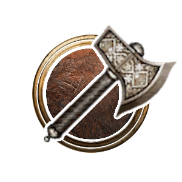

# Arms Fighter

**Arms** is a modded Subclass of [[Fighter]] that learns a broad selection of powerful weapon techniques. Each Arms Strike has its own cooldown, allowing an Arms Fighter to rotate between several specialised attacks.

> {{ get .loca "hb64ef000ga75bg4ed9g86ddgd675d2bb2e2c" | quote }}

## Subclass Features

### Level 3

#### Arms Strikes: 3 Known

Choose 3 [[Arms Strikes]] to know. Each Arms Strike can be used once per [[Short Rest]], and missing with an attack-based Arms Strike does not expend its use.

#### Talent: 1 Known

Choose 1 [[Warrior Talent | #warrior-talents]] from Double Time, Sudden Death, Deep Wounds, or Tactician.

### Level 5

#### Arms Strikes: 4 Known

Choose 1 additional Arms Strike. Slam becomes available.

### Level 7

#### Arms Strikes: 5 Known

Choose 1 additional Arms Strike. Storm Bolt and Colossus Smash become available.

#### Talents: 2 Known

Choose 1 additional Warrior Talent. Anger Management becomes available.

### Level 9

#### Arms Strikes: 6 Known

Choose 1 additional Arms Strike.

### Level 10

#### Talents: 3 Known

Choose 1 additional Warrior Talent.

### Level 11

#### Arms Strikes: 7 Known

Choose 1 additional Arms Strike.

## Arms Strikes

Unless noted otherwise, an Arms Strike costs an [[Action Point]] and can be used once per [[Short Rest]].

### Available at Level 3

![[images/ControllerIcons/skills_png/Action_Rush.png]]

#### Charge

- Costs 1 [[Bonus Action]]
- 9m range, [[Strength]] Saving Throw against your Weapon Action DC
- {{ getf .loca "hf0da666cg2c85g4ec5g8e19g809ec529afbf" "1" | include "wikify" }}

![[Game/ControllerUIIcons/skills_png/Action_DivineStrike_Physical_Melee.png]]

#### Execute

- Melee weapon attack; requires a target at or below 50% [[Hit Points]]
- {{ getf .loca "h9baff8c6gb3d0g4292gb126gf254ec89fb28" "50%" "[2](## 'Proficiency Bonus')d6" | include "wikify" }}

![[Game/ControllerUIIcons/skills_png/Action_Multiattack_WhirlwindAttack.png]]

#### Whirlwind

- 2m radius melee weapon attack that deals half weapon damage
- {{ get .loca "ha331a835gf3c8g4043gaa9ag68646d8ff4ac" | include "wikify" }}

![[Game/ControllerUIIcons/skills_png/Action_Mag_GrandSlam.png]]

#### Thunder Clap

- [[Constitution]] Saving Throw against your Weapon Action DC; affects nearby enemies
- Deals [[Thunder Damage]], knocks creatures Prone on a failed save, and leaves them Off Balance on a successful save
- {{ get .loca "h1b63a656g6499g4b52g91f6g758d6e5adbff" | include "wikify" }}

![[Game/ControllerUIIcons/skills_png/PassiveFeature_GuidedStrike.png]]

#### Overpower

- Triggered as an interrupt after missing with a melee weapon attack
- {{ get .loca "h921192a5g0910g47c0gbb85g3cfdde961410" | include "wikify" }}

![[Game/ControllerUIIcons/skills_png/Action_SweepingAttack.png]]

#### Sweeping Strikes

- Costs 1 [[Bonus Action]]
- {{ get .loca "h5c4bc3bdg0b93g4cf7gb699ge1b657b5d2e9" | include "wikify" }}
- Expires on [[Short Rest]]

![[Game/ControllerUIIcons/skills_png/Action_Cleave_New.png]]

#### Cleave

- Melee weapon attack in a cone
- {{ getf .loca "h1758449dg7435g46a0g8088g4485293de676" "3" | include "wikify" }}

![[Game/ControllerUIIcons/skills_png/Action_FullSwing.png]]

#### Mortal Strike

- Melee weapon attack
- {{ get .loca "h39713ea2gd8ccg43bbgab88ge0cab9f1eea8" | include "wikify" }}
- Mortal Wounds lasts 3 turns

### Available at Level 5

![[Game/ControllerUIIcons/skills_png/Action_HeartStopper.png]]

#### Slam

- Melee weapon attack
- {{ get .loca "hb8420ca7g0e1eg4618g9e6cg45c751959a04" | include "wikify" }}
- {{ get .loca "h2417a761gd0bag41e9gb829g965399bdb815" | include "wikify" }}

### Available at Level 7

![[Game/ControllerUIIcons/skills_png/Action_AbsolutePower.png]]

#### Storm Bolt

- 18m range, [[Constitution]] Saving Throw against your Weapon Action DC
- {{ get .loca "ha0bbee44gedc3g403cga8dage3fb613e51c1" | include "wikify" }}

![[Game/ControllerUIIcons/skills_png/Action_PostureBreaker.png]]

#### Colossus Smash

- Melee weapon attack and [[Constitution]] Saving Throw against your Weapon Action DC
- {{ get .loca "hb02ee329g9da8g4fd5gae11gaf2c0a60680c" | include "wikify" }}

## Warrior Talents

Choose Talents at levels 3, 7, and 10. Anger Management is added to the available choices at level 7.

{{ tpl (readFile "Wiki/Snippets/Warrior-Talents.md") $ }}

![[Game/ControllerUIIcons/skills_png/PassiveFeature_GuidedStrike.png]]

### Tactician

{{ get .loca "h21869032g835eg42b1gab8eg59d6c1ff9112" | include "wikify" }}
