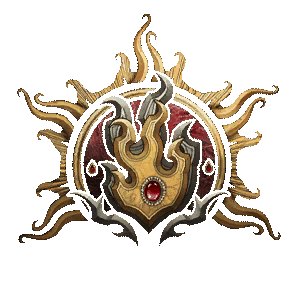

# Magician

**Magician** is an experimental class based on [Sorcerer](https://bg3.wiki/wiki/Sorcerer), with Wizard-style spell learning—including learning from scrolls—and Intelligence as its spellcasting ability.

## Class Features

- Class features that normally use Charisma for a Sorcerer use Intelligence for a Magician.
- Magicians learn half as many spells through levelling as Wizards.
- Magicians use normal Spell Slot progression.

For dialogue purposes, Magicians are tagged as both Sorcerers and Wizards.

For ease of use, Sorcery Points have not been renamed for them.
