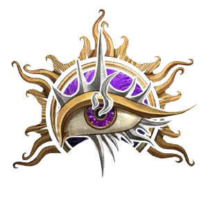

# Witch

**Witch** is an experimental class based on [[Warlock]], but uses normal Spell Slot progression instead of Pact Magic.

## Class Features

- Witches learn spells up to Level 6 and do not need Mystic Arcanum.
- Other class features function like their Warlock counterparts.

For dialogue purposes, Witches are tagged as Warlocks.
