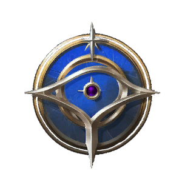

# Arcane Wizard

**Arcane** is a modded Subclass of [[Wizard]] that focuses on utilizing [[Arcane Recovery Charges]] in new ways.

> {{ get .loca "h85acb321g0934g4e65g8e1ag910fa4927572" | quote }}

## Subclass Features

### Level 2

![[Game/ControllerUIIcons/skills_png/Action_Mag_SpellSlotRestoration.png]]

#### Savant

{{ getf .loca "h244a9a72g71c4g4c42g949cg3e3ff6c96b3f" | include "wikify" }}

{{ tpl (readFile "Wiki/Snippets/Talent.md") $ }}

![[Game/ControllerUIIcons/skills_png/PassiveFeature_RitualCaster_MemorizeSpells.png]]

#### Clearcasting

{{ get $.loca "hdadbed99gb582g4458gaa14g3414209c1877" | include "wikify" }}

![[Game/ControllerUIIcons/skills_png/PassiveFeature_RitualCaster_FreeSpells.png]]

#### Arcane Power

{{ getf .loca "h97e20418gbd5cg4be1gba4ag5917999b56da"  | include "wikify" }}

![[images/ControllerIcons/skills_png/Spell_Wizard_ArcaneBlast.png]]

#### Arcane Blast
- Costs 1 [[Action]], 1 [[Arcane Recovery Charge]]
- 18m range
- Deals [1d10/2d10/3d10](# 'Improving at level 5 and 10') [[Force]] damage
- {{ getf .loca "h2ec9328dg0026g4eb5g87f3g1d7e4bae5732"  | include "wikify" }}
- {{ getf .loca "hf4f78f20g8956g4ef6gb91eg588fbcee79e5"  | include "wikify" }}

### Level 6

{{ tpl (readFile "Wiki/Snippets/Talent.md") $ }}

![[images/ControllerIcons/skills_png/PassiveFeature_Wizard_ArcaneMissiles.png]]

#### Arcane Missiles

{{ getf .loca "he453229cgfd5eg469cgb540g3dea852c8733"  | include "wikify" }}

{{ getf .loca "hf88afa74g2837g4c43g8502gae78b5e84495"  | include "wikify" }}

![[images/ControllerIcons/skills_png/PassiveFeature_Wizard_PresenceOfMind.png]]

#### Presence of Mind

{{ getf .loca "h8c3583c5g2b7eg44c3g8a53g7861fd7a25d0"  | include "wikify" }}

![[images/ControllerIcons/skills_png/PassiveFeature_Wizard_PrismaticBarrier.png]]

#### Prismatic Barrier

{{ getf .loca "h8e03c6eagbeb4g4547gba73g952f21135431"  | include "wikify" }}

### Level 10

{{ tpl (readFile "Wiki/Snippets/Talent.md") $ }}

![[Game/ControllerUIIcons/skills_png/Spell_Divination_ArcaneEye.png]]

#### Arcane Intellect

{{ getf .loca "h5ac6cad7g0f2eg4bbfg9ea4ge18c0b6de2f4" "2" | include "wikify" }}

![[images/ControllerIcons/skills_png/Spell_Wizard_ArcaneSurge.png]]

#### Arcane Surge
- Costs 1 [[Action]], 1 to 6 [[Arcane Recovery Charges]]
- 18m range, 4m radius, usable once per [[Short Rest]]
- {{ getf .loca "hb93210ebg5d75g4da9gb641g5d6a6613332d" "1d12 Force Damage" "1d12 Force Damage"  | include "wikify" }}

![[images/ControllerIcons/skills_png/Skill_Wizard_Evocation.png]]

#### Evocation
- Costs 1 [[Bonus Action]]
- [[Concentration]], Usable once per [[Short Rest]]
- {{ getf .loca "h9c306580g5063g4827g8c49g0b7c5c46093d" "2"  | include "wikify" }}

### Level 11

{{ tpl (readFile "Wiki/Snippets/Time-Warp.md") $ }}
