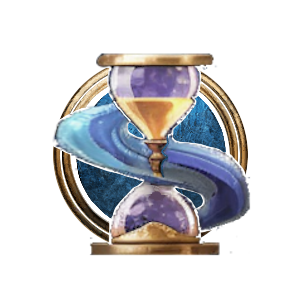
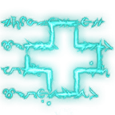
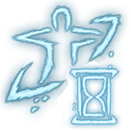
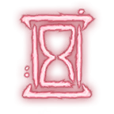
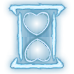

# Chronomancy Wizard

**Chronomancy** is a modded Subclass of [Wizard](https://bg3.wiki/wiki/Wizard) that gives Wizards basic healing capabilities, bonuses with temporally themed spells, and new ways to mess with time. This obviously is not a real Mage specialization from World of Warcraft, but my friends and I have always wished that it was one, so this is the next best thing!

> {{ get .loca "h7b78065bg3146g4c9bg9ea0gc432c8fe994f" | replace "\n" "  " | quote }}

## Subclass Features

### Level 2

#### Time Heals All Wounds

{{ getf .loca "h35d66002g9daag43f5g8a52g19602d973abc"  | include "wikify" }}

This includes:
- Healing Word
- Cure Wounds
- Mass Healing Word
- Revivify
- Death Ward
- Mass Cure Wounds
- Heal

#### Alter Time
- {{ "Usable once per Short Rest" | include "wikify" }}
- {{ "Costs 1 Bonus Action" | include "wikify" }}
- {{ getf .loca "h8524efa2g0cccg4c82g84e9g6519736a1ff7" "3" | include "wikify" }}

### Level 6

#### {{ getf .loca "h8366c262g05d4g4d5fg8cc8g483ee4fc6924"  | include "wikify" }}

{{ getf .loca "h2fde50cagf987g4388g860bgc0ff6543ba3b"  | include "wikify" }}

### Level 10

#### Time Lord

{{ getf .loca "h930fe2a6gaa53g41ecgb9aegbe2bd8c308b1"  | include "wikify" }}

### Level 11

{{ tpl (readFile "Wiki/Snippets/Time-Warp.md") $ }}
