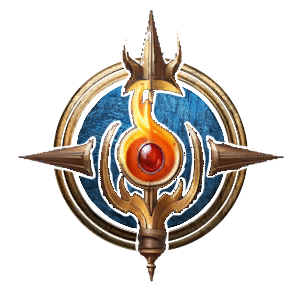

**Fire** is a modded Subclass of [Wizard](https://bg3.wiki/wiki/Wizard) that focuses on utilizing  Fire damage spells and synergizing with Critical Hits.
<h3>

> {{ get .loca "hed3a9cd0gf34bg4a8dg935agb32ee5ab0168" | quote }}

</h3>

# Subclass Features

## Level 2

### Hot Streak

{{ get .loca "h12baa293g17c2g4ea6gb45fg4fbe2978590d" | include "wikify" }}

### Critical Mass

{{ get .loca "h48b215bagb7e3g4fd0gab3eg18c6b4889403" | include "wikify" }}
  
## Level 6

### Ignite

{{ getf .loca "h0c1220a6gfc31g483bga7aeg0df6567e0522" "2" | include "wikify" }}
  
## Level 10

You learn [ Flame Strike](https://bg3.wiki/wiki/Flamestrike) as an Always Prepared spell

### Firestarter

{{ get .loca "ha2328454gab46g4300gb88dg9d52fa8ad601" | include "wikify" }}

Usable Once per [Short Rest](https://bg3.wiki/wiki/Short_Rest).
