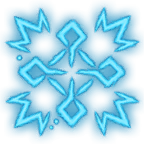

# Frost Wizard

**Frost** is a modded Subclass of [Wizard](https://bg3.wiki/wiki/Wizard) that focuses on utilizing Cold damage spells
> {{ get .loca "hd76d5d39g9c18g4c34g8c4ag3ee5b9237ced" | quote }}

## Subclass Features

### Level 2

#### Shatter

{{ getf .loca "hf458858dg5a2bg4c9egaae1g13e8ccf5ab3d" "5" | include "wikify" }}

### Level 6

#### Fingers of Frost

{{ getf .loca "h3a93972ag6704g4bd4gb1ddgf25f3392d00e" "2" "5" | include "wikify" }}

### Level 10

#### Splitting Ice

{{ get .loca "h79cb1734gb7f4g4f81gb0abg9ff98fd84a90" | include "wikify" }}

#### Ice Block

- {{ "Costs 1 Bonus Action" | include "wikify" }}
- {{ "Once per Short Rest" | include "wikify" }}
- {{ getf .loca "hf5bbbc92gc99cg4b99gb7e4g45402de6d2c1" | include "wikify" }}

### Level 11

{{ tpl (readFile "Wiki/Snippets/Time-Warp.md") $ }}
