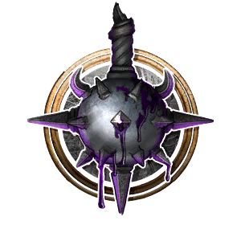

# WoW Subclasses

## New Subraces

### [[Blood Elf]]

Blood Elf is a new a subrace for Elves and Half Elves.

> {{ get .loca "h1ff7536bg6f42g4d36gad70gdb46799e3cc1" | quote }}

## New Subclasses

### [[Fury Barbarian | Barbarian---Fury]]

**Fury** is a modded Subclass of [[Barbarian]] that foregoes the defensive bonuses of [[Rage]] to instead gain more [[Rage Charges]] and new attacks to spend them on. Synergizes heavily with dual wielding.

> {{ get .loca "hf66e9153gca0eg4a51gba5bg7bc315652d59" | quote }}

---

### [[Arms Fighter | Fighter---Arms]]

**Arms** is a modded Subclass of [[Fighter]] that learns a broad selection of powerful weapon techniques, each with its own Short Rest cooldown.

> {{ get .loca "hb64ef000ga75bg4ed9g86ddgd675d2bb2e2c" | quote }}

---

### [[Shadow Domain Cleric | Cleric---Shadow]]

**Shadow Domain** is a modded Subclass of [[Cleric]] that focuses on dealing Psychic damage with less emphasis on healing.

> {{ get .loca "h4efa3342g79d2g46d7g935ag073df6793b59" | quote }}

---

### [[Retribution Paladin | Paladin---Retribution]]

**Oath of Retribution** is a modded Subclass of [[Paladin]] that focuses on using its [[Channel Oath Charges]] on empowered weapon attacks, with strong combat oriented Oath Spells.

> {{ get .loca "h65193088g5aeeg4328ga0b5g955e3ea1f9d9" | quote }}

### [[Holy Paladin | Paladin---Holy]]

**Oath of Holiness** is a modded Subclass of [[Paladin]] that focuses on using its [[Channel Oath Charges]] on new empowered healing abilities, with support oriented Oath Spells.

> {{ get .loca "h20559598gb695g437bg85fag71ee7fc3edbb" | quote }}

### [[Protection Paladin | Paladin---Protection]]

**Oath of Protection** is a modded Subclass of [[Paladin]] that focuses on using its [[Channel Oath Charges]] on new shield-related abilities, with defensive oriented Oath Spells.

> {{ get .loca "hadc1315fg068ag4a5fgab8fgaf4652f9381f" | quote }}

---

### [[Destruction Warlock | Warlock---Destruction]]

**Pact of Destruction** is a modded [[Warlock]] [[Pact]] that focuses on [[Fire]] spells as an alternative to [[Eldritch Blast]].

### [[Demonology Warlock | Warlock---Demonology]]

**Pact of Demonology** is a modded [[Warlock]] [[Pact]] that focuses on summoning an expanded array of Fiends to do its bidding.

---

### [[Fire Wizard | Wizard---Fire]]

**Fire** is a modded Subclass of [[Wizard]] that focuses on utilizing [[Fire]] spells and synergizing with Critical Hits.
> {{ get .loca "hed3a9cd0gf34bg4a8dg935agb32ee5ab0168" | quote }}

### [[Frost Wizard | Wizard---Frost]]

**Frost** is a modded Subclass of [[Wizard]] that focuses on utilizing [[Cold]] spells
> {{ get .loca "hd76d5d39g9c18g4c34g8c4ag3ee5b9237ced" | quote }}

### [[Arcane Wizard | Wizard---Arcane]]

**Arcane** is a modded Subclass of [[Wizard]] that focuses on utilizing [[Arcane Recovery Charges]] in new ways.

> {{ get .loca "h85acb321g0934g4e65g8e1ag910fa4927572" | quote }}

### [[Chronomancy Wizard | Wizard---Chronomancy]]

**Chronomancy** is a modded Subclass of [[Wizard]] that gives Wizards basic healing capabilities, bonuses with temporally themed spells, and new ways to mess with time. This obviously is not a real Mage specialization from World of Warcraft, but my friends and I have always wished that it was one, so this is the next best thing!

> {{ get .loca "h7b78065bg3146g4c9bg9ea0gc432c8fe994f" | replace "\n" "  " | quote }}
